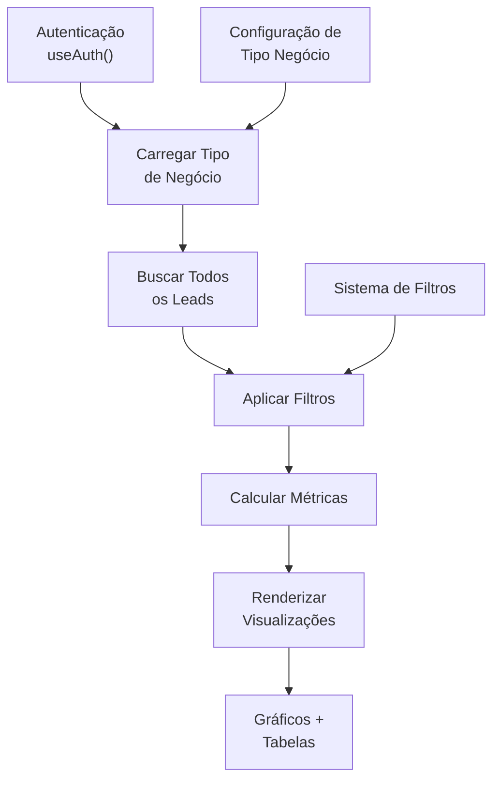

# 📊 Documentação Completa da Página de Relatórios

> **Versão**: 1.0
> **Data**: Outubro 2025
> **Status**: Completo
> **Foco**: Guia completo de funcionalidades e configuração

---

## 📑 Índice

1. [Visão Geral](#1-visão-geral)
2. [Arquitetura do Sistema](#2-arquitetura-do-sistema)
3. [Componentes e Visualizações](#3-componentes-e-visualizações)
4. [Tipos de Relatórios](#4-tipos-de-relatórios)
5. [Gráficos e Dados](#5-gráficos-e-dados)
6. [Sistema de Filtros](#6-sistema-de-filtros)
7. [Métricas Configuráveis](#7-métricas-configuráveis)
8. [Exportação de Dados](#8-exportação-de-dados)
9. [Como Usar a Página](#9-como-usar-a-página)
10. [Configurando Relatórios Personalizados](#10-configurando-relatórios-personalizados)
11. [Boas Práticas](#11-boas-práticas)
12. [Troubleshooting](#12-troubleshooting)
13. [Referência Técnica](#13-referência-técnica)

---

## 1. Visão Geral

### O que é a Página de Relatórios?

A página de relatórios é o **hub de análise e business intelligence** do sistema DNX Recuperação de Crédito. Ela funciona como:

- 📈 **Dashboard executivo** com métricas em tempo real
- 🔍 **Análise profunda** de leads e conversões
- 📊 **Visualização de dados** com 6 tipos diferentes de gráficos
- 💼 **Tomada de decisão** baseada em dados
- 📥 **Exportação** de dados para análise externa

### Localização

```
app/
  └── relatorios/
      └── page.tsx          (Página principal - 1462 linhas)

sql/
  └── 004_create_views_relatorios.sql  (Views SQL de suporte)
```

### Funcionalidades Principais

| Funcionalidade | Descrição |
|---|---|
| **Dashboard Dinâmico** | Adapta-se automaticamente a cada tipo de negócio |
| **4 Relatórios Pré-configurados** | Limpa Nome, Previdenciário, B2B + Genérico |
| **Filtros Avançados** | Campanha, origem, status, data, CNPJ |
| **6 Gráficos Interativos** | Pizza, barras, linha, área |
| **Métricas Personalizáveis** | 4 tipos de cálculos dinâmicos |
| **Funil de Conversão** | Análise visual de estágios |
| **Análise Temporal** | 12 meses de histórico |
| **Campos Customizados** | Análise automática de campos personalizados |
| **Exportação CSV** | Com todos os dados inclusos |

---

## 2. Arquitetura do Sistema

### Fluxo de Dados



### Sequência de Carregamento

**1. Inicialização (First Load)**
```typescript
// Passo 1: Verificar autenticação
const { user } = useAuth()

// Passo 2: Buscar tipo de negócio do usuário
const { data } = await supabase
  .from('user_tipos_negocio')
  .select('tipos_negocio(...)')
  .eq('user_id', userId)
  .eq('ativo', true)
  .single()

// Parse de JSON armazenados
const tipoNegocio = {
  ...data,
  campos_personalizados: parseJSON(data.campos_personalizados, []),
  status_personalizados: parseJSON(data.status_personalizados, []),
  metricas_config: parseJSON(data.metricas_config, [])
}
```

**2. Busca de Dados**
```typescript
// Buscar todos os leads do usuário
const { data: leads } = await supabase
  .from('leads')
  .select('*')
  .eq('user_id', userId)
  .order('created_at', { ascending: false })
```

**3. Extração de Dimensões**
```typescript
// Extrair valores únicos para filtros
const campanhas = [...new Set(leads.map(l => l.nome_campanha))]
const origens = [...new Set(leads.map(l => l.origem))]
```

**4. Cálculo de Métricas**
```typescript
// Sempre executado quando filtros mudam
const filteredLeads = applyFilters(leads)
const metrics = calculateAllMetrics(filteredLeads)
```

### Estrutura de Dados no Banco

#### Tabela `leads`

```sql
CREATE TABLE leads (
  id BIGSERIAL PRIMARY KEY,
  user_id INTEGER NOT NULL,

  -- Dados básicos
  nome_cliente VARCHAR(255),
  telefone VARCHAR(20),
  cpf_cnpj VARCHAR(20),
  email_usuario VARCHAR(255),

  -- Relacionamento
  tipo_negocio_id INTEGER,
  status_generico VARCHAR(100),

  -- Dimensões de análise
  nome_campanha VARCHAR(255),
  origem VARCHAR(100),
  valor_contrato NUMERIC(12,2),
  existe_whatsapp BOOLEAN,

  -- Dados personalizados por tipo
  dados_personalizados JSONB,

  -- Status específicos por tipo
  status_limpa_nome VARCHAR(100),
  status_previdenciario VARCHAR(100),
  status_b2b VARCHAR(100),

  -- Timestamps
  created_at TIMESTAMP DEFAULT NOW(),
  updated_at TIMESTAMP DEFAULT NOW()
);
```

#### Tabela `tipos_negocio`

```sql
CREATE TABLE tipos_negocio (
  id SERIAL PRIMARY KEY,
  nome VARCHAR(100),
  nome_exibicao VARCHAR(150),
  descricao TEXT,

  -- Configurações
  campos_personalizados JSONB,    -- Array de campos customizados
  status_personalizados JSONB,    -- Array de status
  metricas_config JSONB,          -- Array de métricas dinâmicas

  cor VARCHAR(7),
  ativo BOOLEAN,
  ordem INTEGER,
  created_at TIMESTAMP
);
```

**Exemplo de `metricas_config`:**

```json
[
  {
    "nome": "novosLeads",
    "label": "Novos Leads",
    "tipo": "contagem",
    "status": ["novo_lead"]
  },
  {
    "nome": "taxaConversao",
    "label": "Taxa de Conversão",
    "tipo": "percentual",
    "numerador_status": ["cliente_fechado"],
    "denominador_status": ["novo_lead"]
  },
  {
    "nome": "tempoMedioNegociacao",
    "label": "Tempo Médio de Negociação",
    "tipo": "tempo_entre_status",
    "status_inicial": "qualificacao",
    "status_final": "cliente_fechado"
  }
]
```

---

## 3. Componentes e Visualizações

### Layout da Página

```
┌─────────────────────────────────────────────────┐
│  📊 Relatórios [Tipo de Negócio]  [Exportar CSV] │
├─────────────────────────────────────────────────┤
│                                                 │
│  ┌───────────┬───────────┬───────────┬────────┐ │
│  │  Filtro   │  Filtro   │  Filtro   │ Limpar │ │
│  │ Campanha  │  Origem   │  Status   │        │ │
│  └───────────┴───────────┴───────────┴────────┘ │
│  ┌───────────┬───────────┬───────────┬────────┐ │
│  │  Filtro   │  Filtro   │  Filtro   │        │ │
│  │   Data    │   Data    │   CNPJ    │        │ │
│  └───────────┴───────────┴───────────┴────────┘ │
│                                                 │
├─────────────────────────────────────────────────┤
│  CARDS DE MÉTRICAS PRINCIPAIS                   │
│  ┌──────────────┬──────────────┬───────────────┐ │
│  │ Total Leads  │ Com WhatsApp  │ Valor Total   │ │
│  │    1,250     │    875 (70%)  │  R$ 125,000   │ │
│  └──────────────┴──────────────┴───────────────┘ │
│  ┌──────────────┐                               │
│  │ Valor Médio  │                               │
│  │  R$ 100.00   │                               │
│  └──────────────┘                               │
│                                                 │
├─────────────────────────────────────────────────┤
│  MÉTRICAS DINÂMICAS (se configuradas)           │
│  [Cards customizados com valores calculados]    │
│                                                 │
├─────────────────────────────────────────────────┤
│  GRÁFICO 1: Pizza                               │
│  Leads por Status (com core.js)                 │
│                                                 │
├─────────────────────────────────────────────────┤
│  GRÁFICO 2: Barras Horizontal                   │
│  Leads por Origem                               │
│                                                 │
├─────────────────────────────────────────────────┤
│  GRÁFICO 3: Barras                              │
│  Valor Total por Campanha                       │
│                                                 │
├─────────────────────────────────────────────────┤
│  GRÁFICO 4: Área                                │
│  Evolução de Leads                              │
│                                                 │
├─────────────────────────────────────────────────┤
│  CAMPOS PERSONALIZADOS                          │
│  [Análise automática de cada campo]             │
│                                                 │
├─────────────────────────────────────────────────┤
│  FUNIL DE CONVERSÃO                             │
│  [Barras progressivas com taxa de conversão]    │
│                                                 │
├─────────────────────────────────────────────────┤
│  ANÁLISE TEMPORAL (12 meses)                    │
│  [Cards comparativos + gráfico linha dual axis] │
│                                                 │
├─────────────────────────────────────────────────┤
│  VALOR POR CAMPANHA (Tabela)                    │
│  [Tabela com: Campanha, Leads, Valor Total, Média]
│                                                 │
└─────────────────────────────────────────────────┘
```

### Seções Principais

#### 1. **Cabeçalho**

```tsx
<div className="flex items-center justify-between mb-6">
  <div className="flex items-center gap-2">
    <BarChart3 className="h-8 w-8" />
    <h1 className="text-3xl font-bold">
      Relatórios: {userTipoNegocio?.nome_exibicao}
    </h1>
  </div>
  <button onClick={exportToCSV}>
    📥 Exportar CSV
  </button>
</div>
```

#### 2. **Painel de Filtros**

```tsx
<div className="grid grid-cols-2 gap-4 mb-6">
  <select value={filters.campanha} onChange={handleCampanhaChange}>
    <option value="">Todas as Campanhas</option>
    {campanhas.map(c => <option key={c}>{c}</option>)}
  </select>

  <select value={filters.origem} onChange={handleOrigemChange}>
    <option value="">Todas as Origens</option>
    {origens.map(o => <option key={o}>{o}</option>)}
  </select>

  <select value={filters.status} onChange={handleStatusChange}>
    <option value="">Todos os Status</option>
    {userTipoNegocio?.status_personalizados?.map(s => (
      <option key={s}>{s}</option>
    ))}
  </select>

  <input
    type="text"
    placeholder="Buscar por CNPJ..."
    value={filters.cnpj}
    onChange={handleCnpjChange}
  />

  <input
    type="date"
    value={filters.dataInicio}
    onChange={handleDataInicioChange}
  />

  <input
    type="date"
    value={filters.dataFim}
    onChange={handleDataFimChange}
  />

  <button onClick={clearFilters}>Limpar Filtros</button>
</div>
```

#### 3. **Cards de Métricas Principais**

```tsx
<div className="grid grid-cols-2 gap-4 mb-6">
  <MetricCard
    label="Total de Leads"
    value={metrics.total}
    icon="📋"
  />

  <MetricCard
    label="Com WhatsApp"
    value={`${metrics.comWhatsApp} (${metrics.taxaWhatsApp}%)`}
    icon="📱"
  />

  <MetricCard
    label="Valor Total"
    value={`R$ ${metrics.valorTotal.toLocaleString('pt-BR')}`}
    icon="💰"
  />

  <MetricCard
    label="Valor Médio"
    value={`R$ ${metrics.valorMedio}`}
    icon="📊"
  />
</div>
```

---

## 4. Tipos de Relatórios

### Relatório: Limpeza de Nome

**Identificação**: `tipo_negocio.nome = 'limpa_nome'`

**Métricas Padrão**:
- Novos Leads
- Qualificados
- Pagou Consulta
- Dívidas Encontradas
- Clientes Fechados
- Em Negociação
- Leads Perdidos
- Total Geral

**Configuração SQL**:
```sql
metricas_config = '[
  {"nome": "novosLeads", "label": "Novos Leads", "tipo": "contagem", "status": ["novo_lead"]},
  {"nome": "qualificados", "label": "Qualificados", "tipo": "contagem", "status": ["qualificacao"]},
  ...
]'
```

**Campos Padrão Específicos**:
- `status_limpa_nome` - Status específico para este tipo
- `existe_whatsapp` - Flag de contato
- `valor_contrato` - Valor da limpeza

**Campos Personalizados Comuns**:
```json
{
  "cpf": "123.456.789-10",
  "valor_divida": 5000.00,
  "data_negativacao": "2023-01-15",
  "banco_negativador": "Itaú",
  "historico_negativacao": "Negativado desde 2021"
}
```

---

### Relatório: Previdenciário

**Identificação**: `tipo_negocio.nome = 'previdenciario'`

**Métricas Padrão**:
- Novos Casos
- Análise Viabilidade
- Contratos Enviados
- Casos Viáveis
- Casos Finalizados
- Processos Iniciados
- Casos Perdidos
- Total Geral

**Status Específico**:
- `status_previdenciario`

**Campos Personalizados Comuns**:
```json
{
  "tipo_beneficio": "Aposentadoria",
  "tempo_contribuicao": "25 anos",
  "data_ultimo_contribuinte": "2020-06-30",
  "possui_processos": true,
  "prognose_viabilidade": "Alta"
}
```

---

### Relatório: B2B/Corporativo

**Identificação**: `tipo_negocio.nome = 'b2b'`

**Métricas Padrão**:
- Novos Contatos
- Qualificação
- Apresentações
- Propostas Enviadas
- Deals Fechados
- Em Negociação
- Contatos Perdidos
- Total Geral

**Nota Especial**: Para B2B, "Com WhatsApp" é substituído por "Com Contato Válido"

**Campos Padrão Específicos**:
- `nome_empresa` - Nome da empresa (em vez de pessoa física)
- `cpf_cnpj` - CNPJ da empresa

**Campos Personalizados Comuns**:
```json
{
  "numero_funcionarios": 150,
  "faturamento_anual": "R$ 5.000.000",
  "setor_economico": "Tecnologia",
  "decision_maker": "Gerente de Vendas"
}
```

---

### Relatório: Genérico

**Identificação**: Qualquer `tipo_negocio` customizado sem configuração específica

**Métricas Padrão**: Aplica-se relatório base

**Flexibilidade**: 100% customizável via `metricas_config`

---

## 5. Gráficos e Dados

### Biblioteca: Recharts

Todos os gráficos utilizam a biblioteca **Recharts** para renderização responsiva e interativa.

### 5.1 Gráfico Pizza: Leads por Status

**Renderização**:
```tsx
<ResponsiveContainer width="100%" height={300}>
  <PieChart>
    <Pie
      data={statusChartData}
      cx="50%"
      cy="50%"
      labelLine={false}
      label={renderLabel}
      outerRadius={80}
      fill="#8884d8"
      dataKey="value"
    >
      {statusChartData.map((entry, index) => (
        <Cell key={`cell-${index}`} fill={COLORS[index % COLORS.length]} />
      ))}
    </Pie>
    <Tooltip formatter={(value) => `${value} leads`} />
    <Legend />
  </PieChart>
</ResponsiveContainer>
```

**Dados**:
```javascript
statusChartData = [
  { name: "Novo Lead", value: 250 },
  { name: "Qualificação", value: 180 },
  { name: "Em Negociação", value: 120 },
  { name: "Fechado", value: 95 }
]
```

**Interpretação**:
- Fatia maior = status com mais leads
- Cores variam automaticamente
- Clique em legenda para filtrar (Recharts nativo)

---

### 5.2 Gráfico Barras Horizontal: Leads por Origem

**Renderização**:
```tsx
<ResponsiveContainer width="100%" height={300}>
  <BarChart
    data={origemChartData}
    layout="vertical"
    margin={{ top: 5, right: 30, left: 150, bottom: 5 }}
  >
    <CartesianGrid strokeDasharray="3 3" />
    <XAxis type="number" />
    <YAxis dataKey="name" type="category" width={150} />
    <Tooltip />
    <Bar dataKey="value" fill="#3B82F6" />
  </BarChart>
</ResponsiveContainer>
```

**Dados**:
```javascript
origemChartData = [
  { name: "Indicação", value: 450 },
  { name: "Google Ads", value: 320 },
  { name: "Facebook", value: 280 },
  { name: "WhatsApp", value: 200 }
]
```

**Interpretação**:
- Barra mais longa = origem com mais leads
- Ótimo para comparar distribuição

---

### 5.3 Gráfico Barras: Valor por Campanha

**Renderização**:
```tsx
<ResponsiveContainer width="100%" height={400}>
  <BarChart data={campanhaChartData}>
    <CartesianGrid strokeDasharray="3 3" />
    <XAxis dataKey="name" angle={-45} textAnchor="end" height={100} />
    <YAxis />
    <Tooltip formatter={(value) => `R$ ${value.toLocaleString('pt-BR')}`} />
    <Bar dataKey="valor" fill="#10B981" name="Valor Total" />
  </BarChart>
</ResponsiveContainer>
```

**Dados**:
```javascript
campanhaChartData = [
  { name: "Campanha A - Google", valor: 45000 },
  { name: "Campanha B - Facebook", valor: 32000 },
  { name: "Campanha C - Indicação", valor: 28500 }
]
```

---

### 5.4 Gráfico Área: Evolução de Leads

**Renderização**:
```tsx
<ResponsiveContainer width="100%" height={300}>
  <AreaChart data={timelineChartData}>
    <defs>
      <linearGradient id="colorUv" x1="0" y1="0" x2="0" y2="1">
        <stop offset="5%" stopColor="#3B82F6" stopOpacity={0.8}/>
        <stop offset="95%" stopColor="#3B82F6" stopOpacity={0}/>
      </linearGradient>
    </defs>
    <CartesianGrid strokeDasharray="3 3" />
    <XAxis dataKey="date" />
    <YAxis />
    <Tooltip />
    <Area
      type="monotone"
      dataKey="leads"
      stroke="#3B82F6"
      fillOpacity={1}
      fill="url(#colorUv)"
    />
  </AreaChart>
</ResponsiveContainer>
```

**Dados**:
```javascript
timelineChartData = [
  { date: "01/01", leads: 45 },
  { date: "02/01", leads: 52 },
  { date: "03/01", leads: 48 },
  ...
]
```

**Interpretação**:
- Tendência ascendente/descendente visível
- Picos e vales indicam variações

---

### 5.5 Funil de Conversão

**Renderização**:
```tsx
<div>
  {funnelData.map((stage, index) => (
    <div key={stage.status} className="mb-4">
      <div className="flex justify-between mb-1">
        <span>{stage.label}</span>
        <span>{stage.count} leads ({stage.percentage}%)</span>
      </div>
      <div className="w-full bg-gray-200 rounded">
        <div
          className="bg-gradient-to-r from-blue-400 to-blue-600 h-8 rounded flex items-center justify-center text-white text-sm"
          style={{ width: `${(stage.count / funnelData[0].count) * 100}%` }}
        >
          {stage.conversionRate}% conversão
        </div>
      </div>
    </div>
  ))}
</div>
```

**Dados**:
```javascript
funnelData = [
  {
    status: "novo_lead",
    label: "Novo Lead",
    count: 1000,
    percentage: "100%",
    conversionRate: "100%"
  },
  {
    status: "qualificacao",
    label: "Qualificação",
    count: 750,
    percentage: "75%",
    conversionRate: "75%"
  },
  {
    status: "negociacao",
    label: "Em Negociação",
    count: 450,
    percentage: "45%",
    conversionRate: "60%"
  },
  {
    status: "fechado",
    label: "Fechado",
    count: 135,
    percentage: "13.5%",
    conversionRate: "30%"
  }
]
```

---

### 5.6 Análise Temporal (12 Meses)

**Renderização**:
```tsx
<div className="grid grid-cols-3 gap-4 mb-6">
  <MetricCard
    label="Mês Atual"
    value={`${currentMonth.leads} leads`}
  />
  <MetricCard
    label="Mês Anterior"
    value={`${lastMonth.leads} leads`}
  />
  <MetricCard
    label="Crescimento"
    value={`${leadsGrowth > 0 ? '+' : ''}${leadsGrowth}%`}
  />
</div>

<ResponsiveContainer width="100%" height={300}>
  <LineChart data={monthlyTimeline}>
    <CartesianGrid />
    <XAxis dataKey="monthLabel" />
    <YAxis yAxisId="left" />
    <YAxis yAxisId="right" orientation="right" />
    <Tooltip />
    <Legend />
    <Line
      yAxisId="left"
      type="monotone"
      dataKey="leads"
      stroke="#3B82F6"
      name="Leads"
    />
    <Line
      yAxisId="right"
      type="monotone"
      dataKey="valor"
      stroke="#10B981"
      name="Valor (R$)"
    />
  </LineChart>
</ResponsiveContainer>
```

**Dados**:
```javascript
monthlyTimeline = [
  {
    monthKey: "2025-01",
    monthLabel: "Jan 2025",
    leads: 120,
    valor: 45000,
    comWhatsApp: 84
  },
  {
    monthKey: "2025-02",
    monthLabel: "Fev 2025",
    leads: 135,
    valor: 52000,
    comWhatsApp: 98
  },
  // ... 12 meses
]
```

---

## 6. Sistema de Filtros

### Filtros Disponíveis

| Filtro | Tipo | Opções | Efeito |
|--------|------|--------|--------|
| **Campanha** | Dropdown | Todas as campanhas do usuário | Filtra leads da campanha selecionada |
| **Origem** | Dropdown | Todas as origens do usuário | Filtra leads da origem selecionada |
| **Status** | Dropdown | `status_personalizados` do tipo | Filtra leads com status específico |
| **Data Início** | Date Picker | Qualquer data | Filtra leads criados >= data |
| **Data Fim** | Date Picker | Qualquer data | Filtra leads criados <= data (23:59:59) |
| **CNPJ** | Text Input | Qualquer CNPJ | Filtra leads contendo CNPJ |

### Lógica de Filtragem

```typescript
function getFilteredLeads(): Lead[] {
  return leads.filter(lead => {
    // 1. Filtro por Campanha
    if (filters.campanha && lead.nome_campanha !== filters.campanha) {
      return false;
    }

    // 2. Filtro por Origem
    if (filters.origem && lead.origem !== filters.origem) {
      return false;
    }

    // 3. Filtro por Status
    if (filters.status && lead.status_generico !== filters.status) {
      return false;
    }

    // 4. Filtro por CNPJ (busca parcial)
    if (filters.cnpj) {
      const cnpjNormalizado = lead.cpf_cnpj?.replace(/\D/g, '') || '';
      const cnpjFiltro = filters.cnpj.replace(/\D/g, '');
      if (!cnpjNormalizado.includes(cnpjFiltro)) {
        return false;
      }
    }

    // 5. Filtro por Data Início
    if (filters.dataInicio && lead.created_at) {
      const leadDate = new Date(lead.created_at);
      const filterDate = new Date(filters.dataInicio);
      if (leadDate < filterDate) {
        return false;
      }
    }

    // 6. Filtro por Data Fim (incluindo até 23:59:59)
    if (filters.dataFim && lead.created_at) {
      const leadDate = new Date(lead.created_at);
      const filterDate = new Date(filters.dataFim);
      filterDate.setHours(23, 59, 59, 999);
      if (leadDate > filterDate) {
        return false;
      }
    }

    return true;
  });
}
```

### Comportamento de Filtros

**Combinação**: Todos os filtros funcionam em **AND** (lead deve passar em TODOS os filtros)

**Vazio/Nulo**: Campo vazio significa "todas as opções" (sem aplicar filtro)

**Atualização em Tempo Real**: Gráficos e métricas atualizam imediatamente quando filtro muda

**Botão Limpar**: Reseta todos os filtros para strings vazias

### Exemplo de Uso

```typescript
// Estado inicial
filters = {
  campanha: '',
  origem: '',
  status: '',
  dataInicio: '',
  dataFim: '',
  cnpj: ''
}
// Resultado: 1250 leads

// Aplicar: Campanha = "Google Ads"
filters.campanha = 'Google Ads'
// Resultado: 320 leads

// Adicionar: Status = "Fechado"
filters.status = 'cliente_fechado'
// Resultado: 45 leads

// Adicionar: Data entre 01/01/2025 e 31/01/2025
filters.dataInicio = '2025-01-01'
filters.dataFim = '2025-01-31'
// Resultado: 12 leads
```

---

## 7. Métricas Configuráveis

### 4 Tipos de Métricas Dinâmicas

A página suporta 4 tipos de cálculos configuráveis via `metricas_config`:

### Tipo 1: Contagem (`tipo: "contagem"`)

**Descrição**: Conta quantos leads têm um status específico

**Configuração**:
```json
{
  "nome": "novosLeads",
  "label": "Novos Leads",
  "tipo": "contagem",
  "status": ["novo_lead"]
}
```

**Cálculo**:
```typescript
const valor = leads.filter(l =>
  config.status.includes(l.status_generico)
).length
```

**Resultado**: Card mostrando número de leads

---

### Tipo 2: Percentual (`tipo: "percentual"`)

**Descrição**: Calcula percentual entre dois conjuntos de status

**Configuração**:
```json
{
  "nome": "taxaConversao",
  "label": "Taxa de Conversão",
  "tipo": "percentual",
  "numerador_status": ["cliente_fechado"],
  "denominador_status": ["novo_lead"]
}
```

**Cálculo**:
```typescript
const numerador = leads.filter(l =>
  config.numerador_status.includes(l.status_generico)
).length

const denominador = leads.filter(l =>
  config.denominador_status.includes(l.status_generico)
).length

const valor = denominador > 0
  ? ((numerador / denominador) * 100).toFixed(2)
  : 0
```

**Resultado**: "45.32%"

---

### Tipo 3: Tempo Entre Status (`tipo: "tempo_entre_status"`)

**Descrição**: Calcula tempo médio em dias entre dois status

**Configuração**:
```json
{
  "nome": "tempoNegociacao",
  "label": "Tempo Médio de Negociação",
  "tipo": "tempo_entre_status",
  "status_inicial": "qualificacao",
  "status_final": "cliente_fechado"
}
```

**Cálculo**:
```typescript
// Nota: Requer timestamp de mudança de status
// Dados devem ter: lead.status_transitions
const transitions = leads
  .filter(l => l.status_transitions)
  .map(l => {
    const dataInicio = l.status_transitions
      .find(t => t.status === config.status_inicial)?.data
    const dataFim = l.status_transitions
      .find(t => t.status === config.status_final)?.data

    if (dataInicio && dataFim) {
      return (new Date(dataFim) - new Date(dataInicio)) / (1000 * 60 * 60 * 24)
    }
    return null
  })
  .filter(x => x !== null)

const valor = transitions.length > 0
  ? (transitions.reduce((a, b) => a + b) / transitions.length).toFixed(1)
  : 0
```

**Resultado**: "5.3 dias"

---

### Tipo 4: Distribuição (`tipo: "distribuicao"`)

**Descrição**: Analisa distribuição de valores em um campo customizado

**Configuração**:
```json
{
  "nome": "distribuicaoTipoDivida",
  "label": "Distribuição por Tipo de Dívida",
  "tipo": "distribuicao",
  "campo": "tipo_divida"
}
```

**Cálculo**:
```typescript
const distribuicao = {}
leads.forEach(l => {
  const valor = l.dados_personalizados?.[config.campo]
  if (valor) {
    distribuicao[valor] = (distribuicao[valor] || 0) + 1
  }
})

// Resultado com cálculos adicionais
const resultado = Object.entries(distribuicao).map(([chave, valor]) => ({
  label: chave,
  count: valor,
  percentage: ((valor / leads.length) * 100).toFixed(1)
}))
```

**Resultado**:
```
Pessoa Física: 650 (52%)
Pessoa Jurídica: 450 (36%)
Tributária: 150 (12%)
```

---

### Adicionando Métricas Personalizadas

1. **Acessar banco de dados** (SQL)

2. **Localizar a tabela `tipos_negocio`**

3. **Atualizar coluna `metricas_config`**:

```sql
UPDATE tipos_negocio
SET metricas_config = '[
  {
    "nome": "metrica1",
    "label": "Rótulo da Métrica",
    "tipo": "contagem|percentual|tempo_entre_status|distribuicao",
    ...configurações específicas do tipo...
  },
  {
    "nome": "metrica2",
    "label": "Outra Métrica",
    ...
  }
]'::jsonb
WHERE nome = 'seu_tipo';
```

4. **Recarregar a página** para ver as novas métricas

---

## 8. Exportação de Dados

### Funcionalidade: Exportar CSV

**Botão**: Localizado no cabeçalho direito "📥 Exportar CSV"

**Funcionamento**:
```typescript
async function exportToCSV() {
  // 1. Preparar headers
  const headers = [
    'Nome',
    'Telefone',
    'CPF/CNPJ',
    'Status',
    'Campanha',
    'Origem',
    'Valor',
    'WhatsApp',
    'Data',
    // + campos personalizados
    ...userTipoNegocio?.campos_personalizados?.map(c => c.label) || []
  ]

  // 2. Preparar dados
  const rows = filteredLeads.map(lead => [
    lead.nome_cliente,
    lead.telefone,
    lead.cpf_cnpj || lead.cpf || '',
    lead.status_generico,
    lead.nome_campanha,
    lead.origem,
    lead.valor_contrato || '',
    lead.existe_whatsapp ? 'Sim' : 'Não',
    lead.created_at ? new Date(lead.created_at).toLocaleDateString('pt-BR') : '',
    // + valores dos campos personalizados
    ...userTipoNegocio?.campos_personalizados?.map(campo =>
      lead.dados_personalizados?.[campo.nome] || ''
    ) || []
  ])

  // 3. Gerar CSV
  const csv = [
    headers.map(h => `"${h}"`).join(','),
    ...rows.map(row =>
      row.map(cell => `"${cell}"`).join(',')
    )
  ].join('\n')

  // 4. Download
  const element = document.createElement('a')
  element.setAttribute(
    'href',
    'data:text/csv;charset=utf-8,' + encodeURIComponent(csv)
  )
  element.setAttribute(
    'download',
    `relatorio_leads_${new Date().toISOString().split('T')[0]}.csv`
  )
  element.style.display = 'none'
  document.body.appendChild(element)
  element.click()
  document.body.removeChild(element)
}
```

### Características

✅ **BOM UTF-8**: Suporta caracteres especiais (acentos, etc)
✅ **Todas as Colunas**: Campos padrão + personalizados
✅ **Dados Filtrados**: Exporta apenas leads visíveis com filtros aplicados
✅ **Formatação Brasileiro**: Datas em DD/MM/YYYY, valores numéricos com vírgula
✅ **Nome Automático**: `relatorio_leads_YYYY-MM-DD.csv`

### Exemplo de Arquivo Exportado

```csv
"Nome","Telefone","CPF/CNPJ","Status","Campanha","Origem","Valor","WhatsApp","Data","CPF","Valor Dívida"
"João Silva","(11) 99999-9999","123.456.789-10","cliente_fechado","Google Ads","Site","1500","Sim","21/10/2025","123.456.789-10","5000.00"
"Maria Santos","(21) 98888-8888","987.654.321-09","qualificacao","Facebook","Indicação","","Não","20/10/2025","987.654.321-09","3500.00"
```

---

## 9. Como Usar a Página

### Passo 1: Acessar Relatórios

```
1. Fazer login no sistema
2. No menu lateral, clicar em "Relatórios"
3. A página carrega automaticamente com dados do seu tipo de negócio
```

### Passo 2: Entender os Dados Padrão

**Cards Principais** (sempre visíveis):
- **Total de Leads**: Quantidade total de leads no período
- **Com WhatsApp**: Leads que possuem WhatsApp (ou "Com Contato" para B2B)
- **Valor Total**: Soma de todos os valores de contrato
- **Valor Médio**: Valor total ÷ quantidade de leads

```
Exemplo:
Total: 1,250 leads
Com WhatsApp: 875 (70%)
Valor Total: R$ 125,000.00
Valor Médio: R$ 100.00
```

### Passo 3: Interpretar os Gráficos

**Pizza (Status)**:
- Maior fatia = status com mais leads
- Identifique gargalos na conversão

**Barras Horizontal (Origem)**:
- Veja qual canal traz mais leads
- Priorize canais com melhor performance

**Barras Verticais (Valor/Campanha)**:
- Identifique campanhas mais lucrativas
- Compare ROI entre campanhas

**Área (Evolução)**:
- Visualize tendência de crescimento
- Identifique períodos críticos

**Funil**:
- Veja taxa de conversão por estágio
- Identifique onde há maior queda

**Temporal (12 Meses)**:
- Compare mês atual com mês anterior
- Identifique sazonalidade

### Passo 4: Aplicar Filtros

```
1. Selecionar "Campanha" (opcional)
2. Selecionar "Origem" (opcional)
3. Selecionar "Status" (opcional)
4. Digitar "CNPJ" para busca (opcional)
5. Definir "Data Início" (opcional)
6. Definir "Data Fim" (opcional)
7. Clicar em "Limpar Filtros" para resetar
```

**Exemplo de Análise**:
```
Pergunta: Qual a taxa de conversão da campanha Google Ads em janeiro?

Passos:
1. Campanha = "Google Ads"
2. Data Início = "2025-01-01"
3. Data Fim = "2025-01-31"
4. Observar "Funil de Conversão"
5. Taxa de conversão aparece nos cards "Novos Leads" vs "Clientes Fechados"
```

### Passo 5: Exportar Dados

```
1. Aplicar filtros desejados
2. Clicar botão "📥 Exportar CSV"
3. Arquivo baixa automaticamente
4. Abrir em Excel/Sheets para análise adicional
```

---

## 10. Configurando Relatórios Personalizados

### Como Adicionar Novas Métricas

#### Via SQL (Recomendado)

```sql
-- Encontrar seu tipo
SELECT id, nome, metricas_config
FROM tipos_negocio
WHERE nome = 'seu_tipo';

-- Atualizar metricas_config
UPDATE tipos_negocio
SET metricas_config = '[
  {
    "nome": "nuevaMetrica",
    "label": "Nova Métrica",
    "tipo": "contagem",
    "status": ["novo_status"]
  }
]'::jsonb
WHERE nome = 'seu_tipo';
```

#### Exemplo: Adicionar Métrica "Taxa de Qualificação"

```sql
UPDATE tipos_negocio
SET metricas_config = jsonb_set(
  metricas_config,
  '{0}',
  jsonb_build_object(
    'nome', 'taxaQualificacao',
    'label', 'Taxa de Qualificação',
    'tipo', 'percentual',
    'numerador_status', jsonb_build_array('qualificacao'),
    'denominador_status', jsonb_build_array('novo_lead')
  )
)
WHERE nome = 'limpa_nome';
```

### Como Alterar Labels de Métricas

**Encontrar o label**:
```typescript
// Em DashboardConfig no código
const dashboardConfig = {
  title: "Relatórios: Limpeza de Nome",
  metrics: {
    novosLeads: "Novos Leads",      // <-- Alterar aqui
    qualificados: "Qualificados",
    // ...
  }
}
```

**Alterar em banco de dados**:
```sql
UPDATE tipos_negocio
SET metricas_config = jsonb_set(
  metricas_config,
  '{0,label}',
  '"Novas Oportunidades"'  -- Novo label
)
WHERE nome = 'limpa_nome'
AND metricas_config->>0->>'nome' = 'novosLeads';
```

### Como Adicionar Novo Tipo de Relatório

1. **Criar novo tipo de negócio**:
```sql
INSERT INTO tipos_negocio (
  nome,
  nome_exibicao,
  status_personalizados,
  metricas_config,
  cor,
  ativo
) VALUES (
  'novo_tipo',
  'Novo Tipo',
  '[
    "novo",
    "processando",
    "concluido",
    "falhou"
  ]'::jsonb,
  '[
    {
      "nome": "novos",
      "label": "Novos",
      "tipo": "contagem",
      "status": ["novo"]
    },
    {
      "nome": "processando",
      "label": "Processando",
      "tipo": "contagem",
      "status": ["processando"]
    }
  ]'::jsonb,
  '#FF5733',
  true
);
```

2. **Atribuir ao usuário**:
```sql
INSERT INTO user_tipos_negocio (user_id, tipo_negocio_id, ativo)
SELECT $1, id, true
FROM tipos_negocio
WHERE nome = 'novo_tipo';
```

3. **Recarregar a página** - Novo relatório disponível automaticamente

---

## 11. Boas Práticas

### ✅ FAÇA

#### 1. Revise Regularmente os Dados

```
Recomendação: 1x por semana
Objetivo: Identificar tendências cedo
```

#### 2. Use Filtros Estrategicamente

```
Para análise de campanha específica:
- Filtro: Campanha = "Google Ads"
- Análise: Performance com dados isolados
- Ação: Otimizar se performance baixa
```

#### 3. Compare Períodos

```
Mês Atual vs Mês Anterior:
- Visualize card "Crescimento (%)"
- Se negativo, investigar por quê
```

#### 4. Acompanhe o Funil

```
Se taxa de conversão cai em um estágio:
1. Identificar qual estágio (funil visual)
2. Filtrar por esse status
3. Analisar características comuns
4. Ajustar processo se necessário
```

#### 5. Exporte para Análise Profunda

```
Quando: Decisões importantes
Como: Exportar CSV → Excel/Sheets
Análise: Fórmulas, gráficos adicionais
```

---

### ❌ EVITE

#### 1. Confiar Apenas em Gráficos

```
❌ RUIM: "Vejo a fatia vermelha, então está bom"
✅ BOM: Ler números exatos nos tooltips e cards
```

#### 2. Ignorar Dados Antigos

```
❌ RUIM: Olhar apenas dados do mês atual
✅ BOM: Analisar 12 meses para identificar padrões
```

#### 3. Aplicar Filtros Errados

```
❌ RUIM: Filtrar por "Status = Fechado" sem data
          (Mistura dados de todos os períodos)

✅ BOM: Filtrar "Status = Fechado" + "Data" específica
```

#### 4. Esquecer de Atualizar Configurações

```
❌ RUIM: Metricas_config com labels desatualizados
✅ BOM: Manter nomes descritivos e corretos
```

#### 5. Não Documentar Insights

```
❌ RUIM: Ver insight importante e esquecer
✅ BOM: Anotar descobertas e ações para não perder
```

---

## 12. Troubleshooting

### Problema: Página carrega em branco

**Causa Provável**: Usuário não tem tipo de negócio atribuído

**Solução**:
```sql
-- Verificar atribuição
SELECT * FROM user_tipos_negocio
WHERE user_id = 123
AND ativo = true;

-- Se vazio, atribuir:
INSERT INTO user_tipos_negocio (user_id, tipo_negocio_id, ativo)
VALUES (123, 1, true);
```

---

### Problema: Gráficos não aparecem

**Causa Provável**: Dados inválidos em `dados_personalizados`

**Solução**:
```typescript
// Verificar se campos estão parseáveis
try {
  const dados = JSON.parse(lead.dados_personalizados);
  console.log('Dados válidos:', dados);
} catch (e) {
  console.error('JSON inválido:', e);
}
```

---

### Problema: Filtro de data não funciona

**Causa Provável**: Formato de data incorreto ou timezone

**Solução**:
```typescript
// Usar ISO format para segurança
const dataInicio = new Date('2025-01-01').toISOString();

// Ou converter do date picker:
const dataFromPicker = document.querySelector('input[type="date"]').value;
// Valor já vem como YYYY-MM-DD, perfeito para filtro
```

---

### Problema: Exportação CSV não baixa

**Causa Provável**: Bloqueio de downloads ou pop-ups

**Solução**:
```typescript
// Verificar console para erros
console.log('Iniciando download...');

// Se não funcionar, tentar abrir URL em nova aba
const url = 'data:text/csv;charset=utf-8,' + encodeURIComponent(csv);
window.open(url, '_blank');
```

---

### Problema: Métricas mostram 0 ou valor errado

**Causa Provável**: Status não existem nos dados ou nome não bate

**Solução**:
```sql
-- Verificar quais status existem
SELECT DISTINCT status_generico FROM leads
WHERE user_id = 123;

-- Comparar com metricas_config
SELECT metricas_config FROM tipos_negocio
WHERE id = (SELECT tipo_negocio_id FROM leads
            WHERE user_id = 123 LIMIT 1);
```

---

### Problema: Campos personalizados não aparecem em gráfico

**Causa Provável**: Dados não parseáveis ou campo vazio

**Solução**:
```typescript
// Verificar structure
const lead = leads[0];
console.log('dados_personalizados:', lead.dados_personalizados);
console.log('Parsed:', JSON.parse(lead.dados_personalizados));

// Se vazio, não renderiza gráfico
if (!Object.keys(dados).length) {
  console.warn('Nenhum dado personalizado');
}
```

---

## 13. Referência Técnica

### Arquivos Relevantes

| Arquivo | Responsabilidade |
|---------|-----------------|
| `app/relatorios/page.tsx` | Página principal (1462 linhas) |
| `sql/004_create_views_relatorios.sql` | Views SQL de suporte |
| `lib/supabase.ts` | Tipos TypeScript e cliente |
| `components/AuthWrapper` | Autenticação e contexto |

### Tipos TypeScript Principais

```typescript
interface TipoNegocio {
  id: number;
  nome: string;                              // limpa_nome, previdenciario, b2b
  nome_exibicao: string;
  status_personalizados: string[];           // Array de status
  metricas_config: MetricaConfig[];         // Array de métricas dinâmicas
  campos_personalizados: CampoPersonalizado[];
  cor: string;
}

interface MetricaConfig {
  nome: string;                              // ID único
  label: string;                             // Exibição
  tipo: 'contagem' | 'percentual' | 'tempo_entre_status' | 'distribuicao';
  // Campos variáveis conforme tipo
  status?: string[];
  numerador_status?: string[];
  denominador_status?: string[];
  status_inicial?: string;
  status_final?: string;
  campo?: string;
}

interface Lead {
  id: number;
  user_id: number;
  nome_cliente: string;
  telefone: string;
  cpf_cnpj?: string;
  status_generico: string;
  nome_campanha: string;
  origem: string;
  valor_contrato?: number;
  existe_whatsapp?: boolean;
  dados_personalizados?: Record<string, any>;
  created_at: string;
  updated_at: string;
}

interface DashboardMetrics {
  total: number;
  comWhatsApp: number;
  taxaWhatsApp: string;
  valorTotal: number;
  valorMedio: string;
  statusCounts: Record<string, number>;
  campanhaCounts: Record<string, number>;
  campanhaValores: Record<string, number>;
  origemCounts: Record<string, number>;
  timeline: Record<string, number>;
  customFields: Record<string, Record<string, number>>;
  funnel: FunnelStage[];
  temporal: TemporalAnalysis;
  metricasPrincipais: any[];
}

interface FunnelStage {
  status: string;
  label: string;
  count: number;
  percentage: string;
  conversionRate: string;
}

interface TemporalAnalysis {
  monthlyTimeline: MonthData[];
  currentMonth: MonthData;
  lastMonth: MonthData;
  leadsGrowth: number;
  valueGrowth: number;
}
```

### Funções Principais

#### Parse JSON com Fallback
```typescript
function parseJSON<T>(data: any, fallback: T): T {
  try {
    return typeof data === 'string' ? JSON.parse(data) : data || fallback;
  } catch {
    return fallback;
  }
}
```

#### Calcular Métricas
```typescript
function calculateMetrics(leads: Lead[]): DashboardMetrics {
  return {
    total: leads.length,
    comWhatsApp: leads.filter(l => l.existe_whatsapp).length,
    valorTotal: leads.reduce((sum, l) => sum + (l.valor_contrato || 0), 0),
    // ... mais cálculos
  };
}
```

#### Aplicar Filtros
```typescript
function applyFilters(leads: Lead[], filters: any): Lead[] {
  return leads.filter(lead => {
    if (filters.campanha && lead.nome_campanha !== filters.campanha) return false;
    if (filters.status && lead.status_generico !== filters.status) return false;
    // ... mais filtros
    return true;
  });
}
```

### Queries SQL Úteis

#### Buscar Métricas de um Usuário
```sql
SELECT
  COUNT(*) as total_leads,
  COUNT(CASE WHEN existe_whatsapp THEN 1 END) as com_whatsapp,
  SUM(valor_contrato) as valor_total,
  AVG(valor_contrato) as valor_medio
FROM leads
WHERE user_id = $1
AND created_at >= $2
AND created_at <= $3;
```

#### Buscar Leads por Status
```sql
SELECT
  status_generico,
  COUNT(*) as quantidade
FROM leads
WHERE user_id = $1
GROUP BY status_generico
ORDER BY quantidade DESC;
```

#### Buscar Valor por Campanha
```sql
SELECT
  nome_campanha,
  COUNT(*) as total_leads,
  SUM(valor_contrato) as valor_total,
  AVG(valor_contrato) as valor_medio
FROM leads
WHERE user_id = $1
GROUP BY nome_campanha
ORDER BY valor_total DESC;
```

### Cores Padrão (Palette)

```typescript
const COLORS = [
  '#3B82F6',  // Blue
  '#10B981',  // Green
  '#F59E0B',  // Amber
  '#EF4444',  // Red
  '#8B5CF6',  // Purple
  '#EC4899',  // Pink
  '#06B6D4',  // Cyan
  '#84CC16'   // Lime
];
```

### Configuração Recharts

**ResponsiveContainer** (todas os gráficos):
```tsx
<ResponsiveContainer width="100%" height={300}>
  {/* Gráfico aqui */}
</ResponsiveContainer>
```

**Tooltip Customizado**:
```tsx
<Tooltip
  formatter={(value) => {
    if (typeof value === 'number') {
      return `R$ ${value.toLocaleString('pt-BR')}`;
    }
    return value;
  }}
/>
```

**Legend Customizado**:
```tsx
<Legend
  wrapperStyle={{ paddingTop: '20px' }}
  layout="horizontal"
/>
```

---

## 📚 Recursos Adicionais

### Documentação Relacionada

- [DOCUMENTACAO_PAGINA_LEADS.md](DOCUMENTACAO_PAGINA_LEADS.md) - Página de leads
- [DOCUMENTACAO_FLUXO_COMPLETO.md](DOCUMENTACAO_FLUXO_COMPLETO.md) - Fluxo completo
- [IMPLEMENTACAO_SISTEMA_EXTRACAO_LEADS.md](IMPLEMENTACAO_SISTEMA_EXTRACAO_LEADS.md) - Extração

### Bibliotecas Utilizadas

- **Recharts**: https://recharts.org/ - Gráficos interativos
- **React**: https://react.dev/ - Framework
- **TypeScript**: https://www.typescriptlang.org/ - Tipagem
- **Tailwind CSS**: https://tailwindcss.com/ - Estilos
- **Supabase**: https://supabase.com/ - Banco de dados

### Links Úteis

- [Recharts Documentation](https://recharts.org/en-US/api/PieChart)
- [Tailwind CSS Grid](https://tailwindcss.com/docs/grid)
- [Supabase Query Builder](https://supabase.com/docs/reference/javascript/select)

---

## 📞 Suporte e Contato

**Última Atualização**: 21 de outubro de 2025
**Versão**: 1.0
**Status**: ✅ Completo e Pronto para Produção

Para dúvidas ou melhorias, consulte a equipe de desenvolvimento.

---

**Fim da Documentação**
