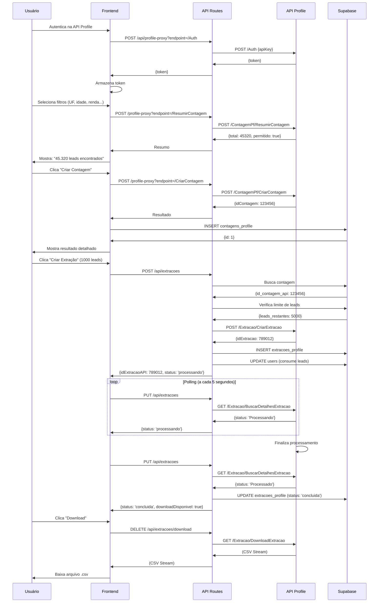

# Documentação: Implementação de Sistema de Extração de Leads

> **Objetivo**: Guia completo para implementar um sistema de extração de leads integrado com API Profile (Datecode/Infinititi) usando Next.js 14 e Supabase PostgreSQL, com filtros avançados para Pessoa Física e Pessoa Jurídica.

---

## 📋 Índice

1. [Visão Geral da Arquitetura](#1-visão-geral-da-arquitetura)
2. [Pré-requisitos e Configuração](#2-pré-requisitos-e-configuração)
3. [Database Schema](#3-database-schema)
4. [API Profile - Integração](#4-api-profile-integração)
5. [Frontend - Interface de Extração](#5-frontend-interface-de-extração)
6. [Backend - API Routes](#6-backend-api-routes)
7. [Fluxo Completo de Extração](#7-fluxo-completo-de-extração)
8. [Sistema de Limites e Permissões](#8-sistema-de-limites-e-permissões)
9. [Componentes Auxiliares](#9-componentes-auxiliares)
10. [Troubleshooting](#10-troubleshooting)

---

## 1. Visão Geral da Arquitetura

### Stack Tecnológica

```yaml
Frontend: Next.js 14 (App Router), React, TypeScript, Tailwind CSS
Backend: Next.js API Routes (App Router)
Database: Supabase PostgreSQL
External API: API Profile (Datecode/Infinititi)
Icons: Lucide React
State Management: React Hooks
```

### Fluxo de Dados

```
[Frontend] → [Autenticar API Profile] → [Token]
                        ↓
[Selecionar Filtros PF/PJ] → [Resumir Contagem] → [Total de Leads]
                        ↓
           [Criar Contagem] → [ID Contagem] → [Supabase]
                        ↓
         [Criar Extração] → [Processar] → [Download CSV]
                        ↓
                  [Consumir Leads do Plano]
```

### Estrutura de Arquivos

```
app/
├── extracao-leads/
│   └── page.tsx                    # Interface principal de extração
├── api/
│   ├── profile-proxy/
│   │   └── route.ts                # Proxy para API Profile
│   ├── extracoes/
│   │   ├── route.ts                # CRUD de extrações
│   │   └── download/
│   │       └── route.ts            # Download de extrações
│   └── datecode/
│       ├── route.ts                # Consulta CNPJ
│       ├── cpf/
│       │   └── route.ts            # Consulta CPF
│       └── consulta/
│           └── route.ts            # Consultas gerais
components/
├── ResultadosContagem.tsx
├── ExtracaoProgress.tsx
├── HistoricoContagens.tsx
├── ModalCriarExtracao.tsx
└── SearchableMultiSelect.tsx
lib/
└── permissions.ts                  # Gerenciamento de limites
database/
└── migrations/                     # Migrations SQL
```

---

## 2. Pré-requisitos e Configuração

### 2.1 Configuração da API Profile (Datecode)

**Passo 1: Obter Credenciais**
1. Acesse [Datecode](https://www.datecode.com.br/) ou contate o provedor
2. Crie uma conta empresarial
3. Solicite credenciais de API
4. Anote:
   - **Username** (ex: `seu_email@dominio.com`)
   - **Password** (senha da conta)
   - **API Key** (chave de acesso à API Profile)

**Passo 2: Entender os Endpoints**

| Endpoint | Descrição | Uso |
|----------|-----------|-----|
| `/api/Auth` | Autenticação e geração de token JWT | Obrigatório antes de qualquer operação |
| `/api/ContagemPf/*` | Operações de contagem Pessoa Física | Filtros, resumo, criação |
| `/api/ContagemPj/*` | Operações de contagem Pessoa Jurídica | Filtros, resumo, criação |
| `/api/Extracao/*` | Gerenciamento de extrações | Criar, listar, baixar |

**Passo 3: Estrutura de Dados**

A API Profile trabalha com:
- **Contagem**: Configuração de filtros + quantidade estimada
- **Extração**: Processo de exportar leads em CSV/Excel
- **Tipos de Acesso**: Níveis de detalhamento dos dados (1=Básico, 2=Intermediário, 3=Completo)

### 2.2 Variáveis de Ambiente

Adicione ao `.env.local` e `.env.production.local`:

```bash
# Datecode Configuration (Para consultas avulsas de CPF/CNPJ)
DATECODE_USERNAME=seu_email@dominio.com
DATECODE_PASSWORD=sua_senha_aqui

# API Profile é configurada por usuário na interface
# Cada usuário tem sua própria API Key armazenada no banco de dados
```

### 2.3 Configuração da API Key por Usuário

**Diferença importante**: A API Profile usa API Keys individuais por usuário, armazenadas no banco de dados na tabela `configuracoes_credenciais`.

---

## 3. Database Schema

### 3.1 Tabela `configuracoes_credenciais`

```sql
CREATE TABLE IF NOT EXISTS public.configuracoes_credenciais (
  id SERIAL PRIMARY KEY,
  user_id INTEGER NOT NULL UNIQUE REFERENCES public.users(id) ON DELETE CASCADE,
  apikeydados TEXT, -- API Key da Profile para extração de leads
  created_at TIMESTAMP WITH TIME ZONE DEFAULT NOW(),
  updated_at TIMESTAMP WITH TIME ZONE DEFAULT NOW()
);

-- Índice
CREATE INDEX idx_configuracoes_user_id ON public.configuracoes_credenciais(user_id);

-- RLS
ALTER TABLE public.configuracoes_credenciais ENABLE ROW LEVEL SECURITY;

CREATE POLICY "Users can view their own credentials"
  ON public.configuracoes_credenciais
  FOR SELECT
  USING (auth.uid()::integer = user_id);

CREATE POLICY "Users can update their own credentials"
  ON public.configuracoes_credenciais
  FOR UPDATE
  USING (auth.uid()::integer = user_id);
```

### 3.2 Tabela `contagens_profile`

Armazena configurações de contagens (filtros aplicados e resultados).

```sql
CREATE TABLE IF NOT EXISTS public.contagens_profile (
  id SERIAL PRIMARY KEY,
  user_id INTEGER NOT NULL REFERENCES public.users(id) ON DELETE CASCADE,
  id_contagem_api INTEGER NOT NULL, -- ID retornado pela API Profile
  nome_contagem VARCHAR(255) NOT NULL,
  tipo_pessoa VARCHAR(2) NOT NULL CHECK (tipo_pessoa IN ('pf', 'pj')),
  total_registros INTEGER NOT NULL DEFAULT 0,
  dados_filtros JSONB NOT NULL, -- Filtros aplicados (idade, renda, etc)
  dados_resultado JSONB, -- Resultado detalhado da API
  status VARCHAR(50) DEFAULT 'concluida',
  data_criacao TIMESTAMP WITH TIME ZONE DEFAULT NOW(),
  data_conclusao TIMESTAMP WITH TIME ZONE,
  created_at TIMESTAMP WITH TIME ZONE DEFAULT NOW(),
  updated_at TIMESTAMP WITH TIME ZONE DEFAULT NOW()
);

-- Índices
CREATE INDEX idx_contagens_user_id ON public.contagens_profile(user_id);
CREATE INDEX idx_contagens_tipo_pessoa ON public.contagens_profile(tipo_pessoa);
CREATE INDEX idx_contagens_status ON public.contagens_profile(status);

-- RLS
ALTER TABLE public.contagens_profile ENABLE ROW LEVEL SECURITY;

CREATE POLICY "Users can view their own contagens"
  ON public.contagens_profile
  FOR SELECT
  USING (auth.uid()::integer = user_id);

CREATE POLICY "Users can insert their own contagens"
  ON public.contagens_profile
  FOR INSERT
  WITH CHECK (auth.uid()::integer = user_id);
```

### 3.3 Tabela `extracoes_profile`

Armazena histórico de extrações solicitadas.

```sql
CREATE TABLE IF NOT EXISTS public.extracoes_profile (
  id SERIAL PRIMARY KEY,
  user_id INTEGER NOT NULL REFERENCES public.users(id) ON DELETE CASCADE,
  contagem_id INTEGER NOT NULL REFERENCES public.contagens_profile(id) ON DELETE CASCADE,
  id_extracao_api INTEGER NOT NULL, -- ID retornado pela API Profile
  nome_arquivo VARCHAR(255) NOT NULL,
  formato_arquivo VARCHAR(10) DEFAULT 'csv',
  total_registros_extraidos INTEGER NOT NULL DEFAULT 0,
  status VARCHAR(50) DEFAULT 'processando', -- processando, concluida, erro
  data_solicitacao TIMESTAMP WITH TIME ZONE DEFAULT NOW(),
  data_conclusao TIMESTAMP WITH TIME ZONE,
  created_at TIMESTAMP WITH TIME ZONE DEFAULT NOW(),
  updated_at TIMESTAMP WITH TIME ZONE DEFAULT NOW()
);

-- Índices
CREATE INDEX idx_extracoes_user_id ON public.extracoes_profile(user_id);
CREATE INDEX idx_extracoes_contagem_id ON public.extracoes_profile(contagem_id);
CREATE INDEX idx_extracoes_status ON public.extracoes_profile(status);

-- RLS
ALTER TABLE public.extracoes_profile ENABLE ROW LEVEL SECURITY;

CREATE POLICY "Users can view their own extracoes"
  ON public.extracoes_profile
  FOR SELECT
  USING (auth.uid()::integer = user_id);

CREATE POLICY "Users can insert their own extracoes"
  ON public.extracoes_profile
  FOR INSERT
  WITH CHECK (auth.uid()::integer = user_id);
```

### 3.4 Estrutura de Dados JSONB

#### Filtros Pessoa Física (`dados_filtros`)

```typescript
interface ContagemPf {
  idadeMinima?: number
  idadeMaxima?: number
  rendaMinimo?: number
  rendaMaximo?: number
  possuiMae?: boolean
  possuiEndereco?: boolean
  possuiEmail?: boolean
  possuiTelefone?: boolean
  possuiCelular?: boolean
  sexos?: string[]              // ['M', 'F']
  classesSociais?: string[]     // ['A', 'B1', 'B2', 'C1', 'C2', 'D', 'E']
  estadosCivis?: string[]       // ['01', '02', '03', ...]
  profissoes?: string[]         // CBOs: ['123456', '789012', ...]
  scores?: string[]             // ['A', 'B', 'C', 'D', 'E']
  operadorasCelular?: string[]  // ['CLARO', 'VIVO', 'TIM', 'OI']
  dddsCelular?: string[]        // ['11', '21', '47', ...]
}

// Exemplo:
{
  "idadeMinima": 25,
  "idadeMaxima": 45,
  "rendaMinimo": 2000,
  "rendaMaximo": 8000,
  "possuiCelular": true,
  "possuiEmail": true,
  "sexos": ["M"],
  "classesSociais": ["B1", "B2", "C1"],
  "scores": ["A", "B"],
  "dddsCelular": ["11", "21", "47"]
}
```

#### Filtros Pessoa Jurídica (`dados_filtros`)

```typescript
interface ContagemPj {
  dataAberturaMinima?: string     // ISO format: "2015-01-01"
  dataAberturaMaxima?: string
  numeroFuncionariosMinimo?: number
  numeroFuncionariosMaximo?: number
  numeroSociosMinimo?: number
  numeroSociosMaximo?: number
  faturamentoMinimo?: number
  faturamentoMaximo?: number
  somenteMatriz?: boolean
  possuiEndereco?: boolean
  possuiEmail?: boolean
  possuiTelefone?: boolean
  possuiCelular?: boolean
  cnaes?: string[]                // ['4520001', '6201500', ...]
  portes?: string[]               // ['ME', 'EPP', 'MEDIO', 'GRANDE']
  tiposEmpresa?: string[]         // ['LTDA', 'SA', 'EIRELI', ...]
  scores?: string[]
  operadorasCelular?: string[]
  dddsCelular?: string[]
}

// Exemplo:
{
  "dataAberturaMinima": "2015-01-01",
  "numeroFuncionariosMinimo": 10,
  "numeroFuncionariosMaximo": 50,
  "somenteMatriz": true,
  "possuiEmail": true,
  "cnaes": ["6201500", "6202300"],
  "portes": ["EPP", "MEDIO"],
  "tiposEmpresa": ["LTDA"]
}
```

---

## 4. API Profile - Integração

### 4.1 Proxy Route - `/app/api/profile-proxy/route.ts`

**Por que um proxy?**
- Evitar expor credenciais no frontend
- Centralizar autenticação
- Adicionar logging e controle

**Código Completo**:

```typescript
import { NextRequest, NextResponse } from 'next/server'

const PROFILE_API_BASE = 'https://apiprofile.infinititi.com.br/api'

export async function GET(request: NextRequest) {
  const { searchParams } = new URL(request.url)
  const endpoint = searchParams.get('endpoint')
  const token = request.headers.get('authorization')

  if (!endpoint) {
    return NextResponse.json({ error: 'Endpoint is required' }, { status: 400 })
  }

  try {
    const headers: HeadersInit = {
      'Content-Type': 'application/json',
    }

    if (token) {
      headers['Authorization'] = token
    }

    const response = await fetch(`${PROFILE_API_BASE}${endpoint}`, {
      method: 'GET',
      headers
    })

    const data = await response.json()
    return NextResponse.json(data)
  } catch (error) {
    console.error('Profile API Error:', error)
    return NextResponse.json({ error: 'Failed to fetch from Profile API' }, { status: 500 })
  }
}

export async function POST(request: NextRequest) {
  const { searchParams } = new URL(request.url)
  const endpoint = searchParams.get('endpoint')
  const token = request.headers.get('authorization')
  const body = await request.json()

  if (!endpoint) {
    return NextResponse.json({ error: 'Endpoint is required' }, { status: 400 })
  }

  try {
    const headers: HeadersInit = {
      'Content-Type': 'application/json',
    }

    if (token) {
      headers['Authorization'] = token
    }

    const response = await fetch(`${PROFILE_API_BASE}${endpoint}`, {
      method: 'POST',
      headers,
      body: JSON.stringify(body)
    })

    const data = await response.json()
    return NextResponse.json(data)
  } catch (error) {
    console.error('Profile API Error:', error)
    return NextResponse.json({ error: 'Failed to fetch from Profile API' }, { status: 500 })
  }
}
```

### 4.2 Autenticação

```typescript
async function authenticateAPI(apiKey: string): Promise<string> {
  const response = await fetch(`${API_PROFILE_BASE}/api/Auth`, {
    method: 'POST',
    headers: {
      'accept': 'text/plain',
      'Content-Type': 'application/json'
    },
    body: JSON.stringify({ apiKey })
  })

  if (!response.ok) {
    throw new Error(`Falha na autenticação: ${response.status}`)
  }

  const data = await response.json()
  return data.token  // Token JWT válido por tempo limitado
}
```

### 4.3 Endpoints Principais

#### Listar UFs

```typescript
GET /ContagemPf/ListarUfs
GET /ContagemPj/ListarUfs

Response:
[
  { "idUf": 25, "uf1": "SC", "ufDescricao": "Santa Catarina" },
  { "idUf": 35, "uf1": "SP", "ufDescricao": "São Paulo" }
]
```

#### Listar Municípios

```typescript
GET /ContagemPf/ListarMunicipios?idsUfs=25&idsUfs=35
GET /ContagemPj/ListarMunicipios?idsUfs=25&idsUfs=35

Response:
[
  { "idcidade": 8801, "cidade1": "Florianópolis", "idUf": 25, "uf": "SC" },
  { "idcidade": 9668, "cidade1": "São Paulo", "idUf": 35, "uf": "SP" }
]
```

#### Resumir Contagem

```typescript
POST /ContagemPf/ResumirContagem
POST /ContagemPj/ResumirContagem

Body:
{
  "nomeContagem": "Leads Executivos SP",
  "estadosMunicipios": {
    "idsUfs": [35],
    "idsMunicipios": [9668]
  },
  "contagemPf": {
    "idadeMinima": 30,
    "idadeMaxima": 50,
    "rendaMinimo": 5000,
    "possuiCelular": true,
    "possuiEmail": true
  }
}

Response:
{
  "sucesso": true,
  "msg": "Contagem realizada com sucesso",
  "limiteContagem": "100000",
  "total": "45320",
  "permitido": true
}
```

#### Criar Contagem

```typescript
POST /ContagemPf/CriarContagem
POST /ContagemPj/CriarContagem

Body: (mesmo formato do ResumirContagem)

Response:
{
  "sucesso": true,
  "msg": "Contagem criada com sucesso",
  "idContagem": 123456,
  "quantidades": [
    { "descricao": "Total", "total": 45320 },
    { "descricao": "Com Celular", "total": 45320 },
    { "descricao": "Com Email", "total": 38450 }
  ]
}
```

#### Criar Extração

```typescript
POST /Extracao/CriarExtracao

Body:
{
  "idContagem": 123456,
  "idTipoAcesso": 3,  // 1=Básico, 2=Intermediário, 3=Completo
  "qtdeSolicitada": 1000,
  "removerRegistrosExtraidos": true
}

Response:
{
  "sucesso": true,
  "msg": "Extração criada com sucesso",
  "idExtracao": 789012
}
```

#### Buscar Detalhes da Extração

```typescript
GET /Extracao/BuscarDetalhesExtracao?idExtracao=789012

Response:
{
  "sucesso": true,
  "idExtracao": 789012,
  "status": "Processado", // ou "Processando", "Erro", "Finalizada"
  "dataFinalizacao": "26/09/2025 13:57:05",
  "quantidadeExtraida": 1000,
  "nomeArquivo": "extracao_789012.csv"
}
```

#### Download da Extração

```typescript
GET /Extracao/DownloadExtracao?idExtracao=789012

Response: (Stream de arquivo CSV)
Headers:
  Content-Type: text/csv
  Content-Disposition: attachment; filename="extracao_789012.csv"
```

---

## 5. Frontend - Interface de Extração

### 5.1 Página Principal - `/app/extracao-leads/page.tsx`

**Estrutura da Interface**:

```
┌─────────────────────────────────────────────┐
│ [Nova Extração] [Histórico]  <- Abas       │
├─────────────────────────────────────────────┤
│                                              │
│  [Pessoa Física] [Pessoa Jurídica]         │
│                                              │
│  Nome da Contagem: [________________]       │
│                                              │
│  Estados: [Select Multiple]                 │
│  Cidades: [Select Multiple]                 │
│                                              │
│  === Filtros Específicos ===                │
│  (Idade, Renda, Sexo, etc... ou              │
│   Data Abertura, CNAE, Porte, etc...)       │
│                                              │
│  [Calcular Resumo] [Criar Contagem]        │
│                                              │
│  Total Estimado: 45.320 leads               │
└─────────────────────────────────────────────┘
```

### 5.2 Estados e Hooks

```typescript
// Estado da autenticação
const [apiConfig, setApiConfig] = useState({
  token: '',
  authenticated: false
})

// Tipo de pessoa
const [tipoPessoa, setTipoPessoa] = useState<'pf' | 'pj'>('pf')

// Localização
const [selectedUfs, setSelectedUfs] = useState<number[]>([])
const [selectedCidades, setSelectedCidades] = useState<number[]>([])

// Filtros
const [filtrosPf, setFiltrosPf] = useState<ContagemPf>({})
const [filtrosPj, setFiltrosPj] = useState<ContagemPj>({})

// Resultados
const [resumoContagem, setResumoContagem] = useState<ResumoContagemVM | null>(null)
const [resultadoContagem, setResultadoContagem] = useState<ContagemRetornoVM | null>(null)
```

### 5.3 Fluxo de Autenticação

```typescript
const authenticateAPI = async () => {
  const credenciais = await supabase
    .from('configuracoes_credenciais')
    .select('apikeydados')
    .eq('user_id', user.id)
    .single()

  if (!credenciais.data?.apikeydados) {
    throw new Error('API Key da Profile não encontrada.')
  }

  const response = await fetch('/api/profile-proxy?endpoint=/Auth', {
    method: 'POST',
    headers: { 'Content-Type': 'application/json' },
    body: JSON.stringify({ apiKey: credenciais.data.apikeydados })
  })

  const data = await response.json()

  if (data.token) {
    setApiConfig({
      token: data.token,
      authenticated: true
    })
  }
}
```

### 5.4 Carregamento de Filtros

```typescript
// Carregar UFs
const loadUfs = async () => {
  const endpoint = tipoPessoa === 'pf' ? '/ContagemPf/ListarUfs' : '/ContagemPj/ListarUfs'
  const response = await fetch('/api/profile-proxy?endpoint=' + endpoint, {
    headers: { 'Authorization': `Bearer ${apiConfig.token}` }
  })
  const data = await response.json()
  setUfs(data || [])
}

// Carregar Cidades
const loadCidades = async () => {
  const endpoint = tipoPessoa === 'pf' ? '/ContagemPf/ListarMunicipios' : '/ContagemPj/ListarMunicipios'
  const params = new URLSearchParams()
  selectedUfs.forEach(uf => params.append('idsUfs', uf.toString()))

  const response = await fetch(
    `/api/profile-proxy?endpoint=${encodeURIComponent(`${endpoint}?${params.toString()}`)}`,
    { headers: { 'Authorization': `Bearer ${apiConfig.token}` } }
  )
  const data = await response.json()
  setCidades(data || [])
}
```

### 5.5 Criar Contagem

```typescript
const criarContagem = async () => {
  const endpoint = tipoPessoa === 'pf' ? '/ContagemPf/CriarContagem' : '/ContagemPj/CriarContagem'

  const payload = {
    nomeContagem,
    estadosMunicipios: {
      idsUfs: selectedUfs,
      idsMunicipios: selectedCidades
    },
    [tipoPessoa === 'pf' ? 'contagemPf' : 'contagemPj']: tipoPessoa === 'pf' ? filtrosPf : filtrosPj
  }

  const response = await fetch('/api/profile-proxy?endpoint=' + endpoint, {
    method: 'POST',
    headers: {
      'Authorization': `Bearer ${apiConfig.token}`,
      'Content-Type': 'application/json'
    },
    body: JSON.stringify(payload)
  })

  const data = await response.json()

  if (data.sucesso) {
    // Salvar no banco
    await salvarContagemNoBanco(data, payload)
    setResultadoContagem(data)
  }
}
```

### 5.6 Filtros Pessoa Física (Exemplo)

```typescript
<div className="bg-white rounded-lg shadow p-6">
  <h3>Idade e Renda</h3>

  <div className="grid grid-cols-4 gap-4">
    <div>
      <label>Idade Mínima</label>
      <input
        type="number"
        value={filtrosPf.idadeMinima || ''}
        onChange={(e) => setFiltrosPf({
          ...filtrosPf,
          idadeMinima: e.target.value ? Number(e.target.value) : undefined
        })}
        placeholder="Ex: 18"
      />
    </div>

    <div>
      <label>Idade Máxima</label>
      <input
        type="number"
        value={filtrosPf.idadeMaxima || ''}
        onChange={(e) => setFiltrosPf({
          ...filtrosPf,
          idadeMaxima: e.target.value ? Number(e.target.value) : undefined
        })}
        placeholder="Ex: 65"
      />
    </div>

    {/* Renda Mínima e Máxima... */}
  </div>
</div>

{/* Checkboxes para dados disponíveis */}
<div className="bg-white rounded-lg shadow p-6">
  <h3>Dados Disponíveis</h3>

  <div className="grid grid-cols-5 gap-4">
    {[
      { key: 'possuiMae', label: 'Possui Mãe' },
      { key: 'possuiEndereco', label: 'Possui Endereço' },
      { key: 'possuiEmail', label: 'Possui E-mail' },
      { key: 'possuiTelefone', label: 'Possui Telefone' },
      { key: 'possuiCelular', label: 'Possui Celular' }
    ].map(item => (
      <label key={item.key}>
        <input
          type="checkbox"
          checked={filtrosPf[item.key as keyof ContagemPf] === true}
          onChange={(e) => setFiltrosPf({
            ...filtrosPf,
            [item.key]: e.target.checked ? true : undefined
          })}
        />
        {item.label}
      </label>
    ))}
  </div>
</div>

{/* Select múltiplo para profissões, classes sociais, etc */}
<SearchableMultiSelect
  options={profissoes.map(p => ({ value: p.cdCbo, label: p.dsCbo }))}
  value={filtrosPf.profissoes || []}
  onChange={(values) => setFiltrosPf({...filtrosPf, profissoes: values as string[]})}
  placeholder="Selecione as profissões"
  searchPlaceholder="Pesquisar profissões..."
/>
```

---

## 6. Backend - API Routes

### 6.1 Criar Extração - `/app/api/extracoes/route.ts` (POST)

**Funcionalidades**:
- Validar permissões do usuário
- Verificar limite de leads
- Autenticar na API Profile
- Criar extração
- Consumir leads do plano
- Salvar no banco local

**Código Completo**:

```typescript
export async function POST(request: NextRequest) {
  const body = await request.json()
  const { contagemId, userId, qtdeSolicitada = 1000, idTipoAcesso = 3, removerRegistrosExtraidos = true, apiKey } = body

  // 1. Buscar contagem
  const { data: contagem } = await supabase
    .from('contagens_profile')
    .select('*')
    .eq('id', contagemId)
    .eq('user_id', userId)
    .single()

  if (!contagem) {
    return NextResponse.json({ error: 'Contagem não encontrada' }, { status: 404 })
  }

  // 2. Calcular quantidade real
  const quantidadeReal = Math.min(qtdeSolicitada, contagem.total_registros)

  // 3. Verificar permissões
  const { data: userPlan } = await getSupabaseAdmin()
    .from('view_usuarios_planos')
    .select('*')
    .eq('id', userId)
    .single()

  if (!hasAvailableLeads(userPlan, quantidadeReal)) {
    const leadsRestantes = getLeadsBalance(userPlan)
    return NextResponse.json({
      error: 'Leads insuficientes',
      details: `Você solicitou ${quantidadeReal} leads, mas possui apenas ${leadsRestantes} disponíveis.`
    }, { status: 429 })
  }

  // 4. Autenticar na API Profile
  const token = await authenticateAPI(apiKey)

  // 5. Criar extração
  const extracaoPayload = {
    idContagem: contagem.id_contagem_api,
    idTipoAcesso,
    qtdeSolicitada: quantidadeReal,
    removerRegistrosExtraidos
  }

  const response = await fetch(`${API_PROFILE_BASE}/api/Extracao/CriarExtracao`, {
    method: 'POST',
    headers: {
      'Authorization': `Bearer ${token}`,
      'Content-Type': 'application/json'
    },
    body: JSON.stringify(extracaoPayload)
  })

  const resultadoExtracao = await response.json()

  if (!resultadoExtracao.sucesso) {
    throw new Error(`API Profile: ${resultadoExtracao.msg}`)
  }

  // 6. Consumir leads do usuário
  await consumeLeads(userId, quantidadeReal)

  // 7. Salvar no banco local
  const nomeArquivo = `leads_${contagem.nome_contagem.replace(/[^a-zA-Z0-9]/g, '_')}_${Date.now()}.csv`

  const { data: novaExtracao } = await supabase
    .from('extracoes_profile')
    .insert([{
      user_id: userId,
      contagem_id: contagemId,
      id_extracao_api: resultadoExtracao.idExtracao,
      nome_arquivo: nomeArquivo,
      total_registros_extraidos: quantidadeReal,
      status: 'processando'
    }])
    .select('*')
    .single()

  // 8. Retornar
  return NextResponse.json({
    extracaoId: novaExtracao?.id,
    idExtracaoAPI: resultadoExtracao.idExtracao,
    nomeArquivo,
    status: 'processando',
    message: 'Extração criada com sucesso!'
  })
}
```

### 6.2 Verificar Status - `/app/api/extracoes/route.ts` (PUT)

```typescript
export async function PUT(request: NextRequest) {
  const { extracaoId, userId, apiKey, idExtracaoAPI } = await request.json()

  // Autenticar
  const token = await authenticateAPI(apiKey)

  // Buscar detalhes
  const response = await fetch(
    `${API_PROFILE_BASE}/api/Extracao/BuscarDetalhesExtracao?idExtracao=${idExtracaoAPI}`,
    {
      headers: { 'Authorization': `Bearer ${token}` }
    }
  )

  const detalhesExtracao = await response.json()

  // Atualizar status no banco
  let statusLocal = 'processando'
  if (detalhesExtracao.status === 'Processado' || detalhesExtracao.status === 'Finalizada') {
    statusLocal = 'concluida'
  } else if (detalhesExtracao.status === 'Erro' || detalhesExtracao.status === 'Cancelada') {
    statusLocal = 'erro'
  }

  await supabase
    .from('extracoes_profile')
    .update({
      status: statusLocal,
      data_conclusao: parseDataFinalizacao(detalhesExtracao.dataFinalizacao)
    })
    .eq('id', extracaoId)

  return NextResponse.json({
    extracao: detalhesExtracao,
    downloadDisponivel: statusLocal === 'concluida'
  })
}
```

### 6.3 Download - `/app/api/extracoes/download/route.ts` (DELETE)

```typescript
export async function DELETE(request: NextRequest) {
  const { idExtracaoAPI, apiKey } = await request.json()

  // Autenticar
  const token = await authenticateAPI(apiKey)

  // Download
  const response = await fetch(
    `${API_PROFILE_BASE}/api/Extracao/DownloadExtracao?idExtracao=${idExtracaoAPI}`,
    {
      headers: { 'Authorization': `Bearer ${token}` }
    }
  )

  if (!response.ok) {
    throw new Error(`Erro no download: ${response.status}`)
  }

  // Retornar arquivo como stream
  const fileBuffer = await response.arrayBuffer()
  const contentType = response.headers.get('content-type') || 'text/csv'
  const filename = response.headers.get('content-disposition')?.match(/filename="(.+)"/)?.[1] || `extracao_${idExtracaoAPI}.csv`

  return new NextResponse(fileBuffer, {
    status: 200,
    headers: {
      'Content-Type': contentType,
      'Content-Disposition': `attachment; filename="${filename}"`,
      'Content-Length': fileBuffer.byteLength.toString()
    }
  })
}
```

---

## 7. Fluxo Completo de Extração

### 7.1 Diagrama de Sequência



### 7.2 Estados da Extração

| Estado | Descrição | Ação do Usuário |
|--------|-----------|-----------------|
| `processando` | API Profile está gerando o arquivo | Aguardar (polling) |
| `concluida` | Arquivo pronto para download | Download disponível |
| `erro` | Erro durante o processamento | Tentar novamente |

---

## 8. Sistema de Limites e Permissões

### 8.1 Arquivo `/lib/permissions.ts`

```typescript
// Verificar se usuário tem leads disponíveis
export function hasAvailableLeads(userPlan: any, quantidade: number): boolean {
  if (!userPlan) return false

  // Se plano customizado, verificar apenas consumo
  if (userPlan.plano_customizado) {
    const consumidos = userPlan.leads_consumidos || 0
    const limite = userPlan.limite_leads || 0
    return (limite - consumidos) >= quantidade
  }

  // Plano normal
  const limite = userPlan.plano_limite_leads || 0
  const consumidos = userPlan.leads_consumidos || 0

  if (limite === -1) return true // Ilimitado

  return (limite - consumidos) >= quantidade
}

// Obter saldo de leads
export function getLeadsBalance(userPlan: any): number {
  if (!userPlan) return 0

  const limite = userPlan.plano_customizado
    ? userPlan.limite_leads
    : userPlan.plano_limite_leads

  const consumidos = userPlan.leads_consumidos || 0

  if (limite === -1) return Infinity

  return Math.max(0, limite - consumidos)
}

// Consumir leads
export async function consumeLeads(userId: number, quantidade: number) {
  const { data, error } = await getSupabaseAdmin()
    .from('users')
    .update({
      leads_consumidos: literal(`leads_consumidos + ${quantidade}`)
    })
    .eq('id', userId)

  if (error) {
    return { success: false, error }
  }

  return { success: true }
}
```

### 8.2 Controle de Acesso via Planos

```sql
-- Campo na tabela planos
ALTER TABLE public.planos
ADD COLUMN IF NOT EXISTS acesso_extracao_leads BOOLEAN DEFAULT TRUE;

-- Atualizar view
DROP VIEW IF EXISTS public.view_usuarios_planos;

CREATE VIEW public.view_usuarios_planos AS
SELECT
  u.id,
  u.leads_consumidos,
  u.limite_leads,
  p.acesso_extracao_leads,
  p.limite_leads AS plano_limite_leads,
  -- outras colunas...
FROM public.users u
LEFT JOIN public.planos p ON u.plano_id = p.id;
```

---

## 9. Componentes Auxiliares

### 9.1 SearchableMultiSelect

Componente reutilizável para seleção múltipla com busca.

```typescript
interface Option {
  value: string | number
  label: string
}

interface Props {
  options: Option[]
  value: (string | number)[]
  onChange: (values: (string | number)[]) => void
  placeholder?: string
  searchPlaceholder?: string
  maxHeight?: string
  disabled?: boolean
}

export default function SearchableMultiSelect({
  options,
  value,
  onChange,
  placeholder = "Selecione",
  searchPlaceholder = "Pesquisar...",
  maxHeight = "200px",
  disabled = false
}: Props) {
  const [search, setSearch] = useState('')
  const [isOpen, setIsOpen] = useState(false)

  const filteredOptions = options.filter(opt =>
    opt.label.toLowerCase().includes(search.toLowerCase())
  )

  const handleToggle = (optValue: string | number) => {
    if (value.includes(optValue)) {
      onChange(value.filter(v => v !== optValue))
    } else {
      onChange([...value, optValue])
    }
  }

  return (
    <div className="relative">
      <button
        type="button"
        onClick={() => !disabled && setIsOpen(!isOpen)}
        disabled={disabled}
        className="w-full px-3 py-2 border rounded-lg text-left"
      >
        {value.length === 0 ? placeholder : `${value.length} selecionado(s)`}
      </button>

      {isOpen && (
        <div className="absolute z-10 w-full mt-1 bg-white border rounded-lg shadow-lg">
          <input
            type="text"
            value={search}
            onChange={(e) => setSearch(e.target.value)}
            placeholder={searchPlaceholder}
            className="w-full px-3 py-2 border-b"
          />

          <div style={{ maxHeight, overflow: 'auto' }}>
            {filteredOptions.map(option => (
              <label
                key={option.value}
                className="flex items-center px-3 py-2 hover:bg-gray-50 cursor-pointer"
              >
                <input
                  type="checkbox"
                  checked={value.includes(option.value)}
                  onChange={() => handleToggle(option.value)}
                  className="mr-2"
                />
                {option.label}
              </label>
            ))}
          </div>
        </div>
      )}
    </div>
  )
}
```

### 9.2 ExtracaoProgress

Modal que faz polling do status da extração.

```typescript
interface Props {
  extracaoId: number
  idExtracaoAPI: number
  nomeArquivo: string
  initialStatus: string
  userId: number
  apiKey: string
  onClose: () => void
}

export default function ExtracaoProgress({
  extracaoId,
  idExtracaoAPI,
  nomeArquivo,
  initialStatus,
  userId,
  apiKey,
  onClose
}: Props) {
  const [status, setStatus] = useState(initialStatus)
  const [detalhes, setDetalhes] = useState<any>(null)

  useEffect(() => {
    if (status === 'concluida') return

    const interval = setInterval(async () => {
      const response = await fetch('/api/extracoes', {
        method: 'PUT',
        headers: { 'Content-Type': 'application/json' },
        body: JSON.stringify({ extracaoId, userId, apiKey, idExtracaoAPI })
      })

      const data = await response.json()

      if (data.extracao) {
        setDetalhes(data.extracao)
        if (data.downloadDisponivel) {
          setStatus('concluida')
          clearInterval(interval)
        }
      }
    }, 5000) // Polling a cada 5 segundos

    return () => clearInterval(interval)
  }, [status])

  const handleDownload = async () => {
    const response = await fetch('/api/extracoes/download', {
      method: 'DELETE',
      headers: { 'Content-Type': 'application/json' },
      body: JSON.stringify({ idExtracaoAPI, apiKey })
    })

    const blob = await response.blob()
    const url = window.URL.createObjectURL(blob)
    const a = document.createElement('a')
    a.href = url
    a.download = nomeArquivo
    a.click()
  }

  return (
    <div className="fixed inset-0 bg-black bg-opacity-50 flex items-center justify-center z-50">
      <div className="bg-white rounded-lg p-6 max-w-md w-full">
        <h3 className="text-xl font-bold mb-4">Processando Extração</h3>

        {status === 'processando' ? (
          <div>
            <Loader2 className="h-8 w-8 animate-spin mx-auto mb-4" />
            <p className="text-center">Aguarde enquanto processamos sua extração...</p>
          </div>
        ) : status === 'concluida' ? (
          <div>
            <CheckCircle className="h-8 w-8 text-green-600 mx-auto mb-4" />
            <p className="text-center mb-4">Extração concluída com sucesso!</p>
            <button
              onClick={handleDownload}
              className="w-full bg-green-600 text-white px-4 py-2 rounded-lg"
            >
              <Download className="h-5 w-5 inline mr-2" />
              Fazer Download
            </button>
          </div>
        ) : (
          <div>
            <AlertCircle className="h-8 w-8 text-red-600 mx-auto mb-4" />
            <p className="text-center">Erro ao processar extração</p>
          </div>
        )}

        <button
          onClick={onClose}
          className="w-full mt-4 border border-gray-300 px-4 py-2 rounded-lg"
        >
          Fechar
        </button>
      </div>
    </div>
  )
}
```

---

## 10. Troubleshooting

### 10.1 Problemas Comuns

| Problema | Causa | Solução |
|----------|-------|---------|
| **401 Unauthorized** | API Key inválida ou expirada | Verificar API Key na tabela `configuracoes_credenciais` |
| **Token expirado** | Token JWT tem tempo limitado | Re-autenticar chamando `/api/Auth` novamente |
| **Contagem vazia** | Filtros muito restritivos | Relaxar alguns filtros e tentar novamente |
| **Limite de leads excedido** | Usuário sem saldo | Verificar `leads_consumidos` vs `limite_leads` |
| **Download não disponível** | Extração ainda processando | Aguardar status mudar para "Processado" |
| **Erro ao carregar UFs** | Token não passado no header | Verificar header `Authorization: Bearer ${token}` |

### 10.2 Debug Logs

Adicionar logs estratégicos:

```typescript
// Autenticação
console.log('🔐 Autenticando com API Key:', apiKey ? 'presente' : 'ausente')
console.log('✅ Token recebido:', token ? token.substring(0, 20) + '...' : 'NULO')

// Contagens
console.log('📊 Payload da contagem:', JSON.stringify(payload, null, 2))
console.log('📊 Resumo recebido:', resumoContagem)

// Extração
console.log('🚀 Criando extração:', { idContagem, qtdeSolicitada, idTipoAcesso })
console.log('📥 Resultado extração:', resultadoExtracao)
console.log('⏱️ Status da extração:', detalhesExtracao.status)
```

### 10.3 Validação de Permissões

Teste manual no console:

```typescript
// No console do navegador
const testPermissions = async () => {
  const response = await fetch('/api/view-usuarios-planos?userId=1')
  const user = await response.json()

  console.log('Limite de leads:', user.plano_limite_leads)
  console.log('Leads consumidos:', user.leads_consumidos)
  console.log('Leads restantes:', user.plano_limite_leads - user.leads_consumidos)
  console.log('Acesso extração:', user.acesso_extracao_leads)
}

testPermissions()
```

### 10.4 Conversão de Datas

A API Profile pode retornar datas em formato brasileiro:

```typescript
function parseDataFinalizacao(dataStr: string | null): string | null {
  if (!dataStr) return null

  try {
    // Formato brasileiro: "26/09/2025 13:57:05"
    if (dataStr.includes('/')) {
      const [datePart, timePart] = dataStr.split(' ')
      const [day, month, year] = datePart.split('/')

      const isoDateStr = `${year}-${month.padStart(2, '0')}-${day.padStart(2, '0')}${timePart ? ' ' + timePart : ''}`

      const date = new Date(isoDateStr)

      if (isNaN(date.getTime())) {
        return null
      }

      return date.toISOString()
    }

    return new Date(dataStr).toISOString()
  } catch (error) {
    console.error('Erro ao processar data:', dataStr, error)
    return null
  }
}
```

---

## 📝 Checklist de Implementação

### Configuração Inicial
- [ ] Obter credenciais da API Profile (Datecode)
- [ ] Adicionar variáveis de ambiente
- [ ] Criar tabelas no Supabase
- [ ] Configurar RLS policies
- [ ] Adicionar campo `acesso_extracao_leads` em planos

### Backend
- [ ] Criar proxy route (`/api/profile-proxy`)
- [ ] Implementar autenticação na API Profile
- [ ] Criar route de extrações (`/api/extracoes`)
- [ ] Implementar GET (listar extrações)
- [ ] Implementar POST (criar extração)
- [ ] Implementar PUT (verificar status)
- [ ] Implementar DELETE (download)
- [ ] Adicionar sistema de limites (`lib/permissions.ts`)

### Frontend
- [ ] Criar página de extração (`/app/extracao-leads/page.tsx`)
- [ ] Implementar seleção PF/PJ
- [ ] Criar formulário de filtros PF
- [ ] Criar formulário de filtros PJ
- [ ] Implementar carregamento de UFs e cidades
- [ ] Adicionar componente SearchableMultiSelect
- [ ] Implementar resumo de contagem
- [ ] Implementar criação de contagem
- [ ] Criar modal de criação de extração
- [ ] Implementar componente ExtracaoProgress
- [ ] Criar página de histórico

### Testes
- [ ] Testar autenticação na API Profile
- [ ] Testar filtros de Pessoa Física
- [ ] Testar filtros de Pessoa Jurídica
- [ ] Testar criação de contagem
- [ ] Testar criação de extração
- [ ] Testar polling de status
- [ ] Testar download de extração
- [ ] Testar limites de leads
- [ ] Testar em produção

---

## 🎯 Melhorias Futuras (Opcional)

- [ ] Cache de tokens da API Profile
- [ ] Retry automático em caso de erro de rede
- [ ] Cancelamento de extrações em andamento
- [ ] Histórico de filtros salvos (templates)
- [ ] Exportação em múltiplos formatos (CSV, Excel, JSON)
- [ ] Agendamento de extrações recorrentes
- [ ] Notificações por email quando extração finalizar
- [ ] Dashboard de consumo de leads
- [ ] Filtros avançados personalizados
- [ ] Deduplicação de leads

---

## 📚 Referências

- [API Profile Documentation](https://apiprofile.infinititi.com.br/)
- [Datecode](https://www.datecode.com.br/)
- [Next.js 14 App Router](https://nextjs.org/docs/app)
- [Supabase PostgreSQL](https://supabase.com/docs/guides/database)

---

**Versão**: 1.0
**Data**: 2025-10-11
**Autor**: DNX Plataformas
**Status**: ✅ Implementado e Testado
