# Documentação: Implementação de Sistema de Integrações (Google Calendar, ZapSign, Asaas)

> **Objetivo**: Guia completo para implementar um sistema de integrações com OAuth2 (Google Calendar), APIs de terceiros (ZapSign, Asaas) usando Next.js 14 e Supabase PostgreSQL.

---

## 📋 Índice

1. [Visão Geral da Arquitetura](#1-visão-geral-da-arquitetura)
2. [Pré-requisitos e Configuração](#2-pré-requisitos-e-configuração)
3. [Database Schema](#3-database-schema)
4. [Integração Google Calendar (OAuth2)](#4-integração-google-calendar-oauth2)
5. [Integrações API Token (ZapSign, Asaas)](#5-integrações-api-token-zapsign-asaas)
6. [Frontend - Interface de Integrações](#6-frontend-interface-de-integrações)
7. [Controle de Acesso e Permissões](#7-controle-de-acesso-e-permissões)
8. [Deployment e Variáveis de Ambiente](#8-deployment-e-variáveis-de-ambiente)
9. [Troubleshooting](#9-troubleshooting)

---

## 1. Visão Geral da Arquitetura

### Stack Tecnológica

```yaml
Frontend: Next.js 14 (App Router), React, TypeScript, Tailwind CSS
Backend: Next.js API Routes (App Router)
Database: Supabase PostgreSQL (JSONB para credenciais)
Auth: Google OAuth2, API Tokens
Icons: Lucide React
```

### Integrações Suportadas

| Integração | Tipo de Auth | Propósito |
|------------|--------------|-----------|
| **Google Calendar** | OAuth2 | Sincronização de agendamentos |
| **ZapSign** | API Token | Assinatura digital de documentos |
| **Asaas** | API Token | Gestão de pagamentos e cobranças |

### Fluxo de Dados

```
[Frontend] → [Iniciar OAuth2] → [Google] → [Callback API] → [Supabase] ✓
                                                              ↓
[Frontend] ← [Fetch Credentials] ← [Supabase DB (JSONB)]
```

### Estrutura de Arquivos

```
app/
├── integracoes/
│   └── page.tsx                          # Interface de integrações
├── api/
│   └── oauth/
│       └── google-calendar/
│           └── callback/
│               └── route.ts              # OAuth2 callback handler
database/
├── add_acesso_integracoes_default.sql
├── fix_view_add_acesso_integracoes.sql
└── update_google_calendar_credentials.sql
```

---

## 2. Pré-requisitos e Configuração

### 2.1 Configuração do Google Cloud Console

**Passo 1: Criar Projeto**
1. Acesse [Google Cloud Console](https://console.cloud.google.com/)
2. Crie um novo projeto ou selecione um existente
3. Nome do projeto: `dnx-plataformas` (ou seu nome)

**Passo 2: Habilitar APIs**
1. Vá em "APIs & Services" → "Library"
2. Busque e habilite:
   - **Google Calendar API**
   - **Google+ API** (para obter email do usuário)

**Passo 3: Criar Credenciais OAuth2**
1. Vá em "APIs & Services" → "Credentials"
2. Clique em "Create Credentials" → "OAuth client ID"
3. Configure:
   - **Application type**: Web application
   - **Name**: `DNX Plataformas - Calendar Integration`
   - **Authorized redirect URIs**:
     - `http://localhost:3000/api/oauth/google-calendar/callback` (desenvolvimento)
     - `https://app.dnxplataformas.com.br/api/oauth/google-calendar/callback` (produção)

4. **IMPORTANTE**: Copie e salve:
   - **Client ID** (ex: `866192050584-xxx.apps.googleusercontent.com`)
   - **Client secret** (ex: `GOCSPX-xxxxx`)

**Passo 4: Configurar Tela de Consentimento OAuth**
1. Vá em "OAuth consent screen"
2. Configure:
   - **User Type**: External
   - **App name**: DNX Plataformas
   - **User support email**: seu_email@gmail.com
   - **Scopes**:
     - `https://www.googleapis.com/auth/calendar`
     - `https://www.googleapis.com/auth/userinfo.email`
   - **Authorized domains**: `dnxplataformas.com.br`

### 2.2 Configuração ZapSign

1. Acesse [ZapSign Dashboard](https://app.zapsign.com.br/)
2. Vá em **Configurações** → **API**
3. Copie seu **API Token**
4. Para cada modelo de documento:
   - Vá em **Modelos**
   - Copie o **ID do Modelo** (visível na URL ou configurações)
   - Anote **Nome** e **Descrição** para identificação

### 2.3 Configuração Asaas

1. Acesse [Asaas Dashboard](https://www.asaas.com/)
2. Vá em **Minha Conta** → **Integrações** → **API**
3. Copie seu **Access Token**
   - **Sandbox**: `$aact_YTU5YTE0M2M2N2I4MTliNzk0YTI5N2U5MzdjNWZmNDQ6OjAwMDAwMDAwMDAwMDAwODg1MTk6OiRhYWNoXzRmMzZmNmI5LTI0MzAtNGEzZC1hYzYxLWNmMDU5YmMxMzAwNA==`
   - **Produção**: `$aact_prod_xxxxx`

### 2.4 Variáveis de Ambiente

Adicione ao `.env.local` e `.env.production.local`:

```bash
# Google OAuth2 Configuration
NEXT_PUBLIC_GOOGLE_CLIENT_ID=866192050584-xxx.apps.googleusercontent.com
NEXT_PUBLIC_GOOGLE_CLIENT_SECRET=GOCSPX-xxxxx

# IMPORTANTE: Variáveis NEXT_PUBLIC são expostas no browser
# Isso é intencional para construir a URL de autorização OAuth2
```

⚠️ **ATENÇÃO**:
- As variáveis com `NEXT_PUBLIC_` são expostas no navegador
- Isso é necessário para construir a URL de autorização OAuth2
- O `client_secret` é enviado apenas no callback do servidor, nunca exposto em logs

---

## 3. Database Schema

### 3.1 Tabela `credencias_diversas`

Esta tabela usa **JSONB** para armazenar credenciais de múltiplas integrações de forma flexível.

```sql
-- Criar tabela de credenciais diversas
CREATE TABLE IF NOT EXISTS public.credencias_diversas (
  id SERIAL PRIMARY KEY,
  user_id INTEGER NOT NULL UNIQUE REFERENCES public.users(id) ON DELETE CASCADE,

  -- Google Calendar (OAuth2)
  google_calendar JSONB DEFAULT '{"email": "", "refresh_token": "", "client_id": "", "client_secret": ""}'::jsonb,

  -- ZapSign (API Token)
  zapsign JSONB DEFAULT '{"token": "", "modelos": []}'::jsonb,

  -- Asaas (API Token)
  asaas JSONB DEFAULT '{"access_token": ""}'::jsonb,

  created_at TIMESTAMP WITH TIME ZONE DEFAULT NOW(),
  updated_at TIMESTAMP WITH TIME ZONE DEFAULT NOW()
);

-- Índices
CREATE INDEX idx_credencias_user_id ON public.credencias_diversas(user_id);

-- RLS (Row Level Security)
ALTER TABLE public.credencias_diversas ENABLE ROW LEVEL SECURITY;

-- Policy: usuários veem apenas suas próprias credenciais
CREATE POLICY "Users can view their own credentials"
  ON public.credencias_diversas
  FOR SELECT
  USING (auth.uid()::integer = user_id);

-- Policy: usuários podem atualizar suas próprias credenciais
CREATE POLICY "Users can update their own credentials"
  ON public.credencias_diversas
  FOR UPDATE
  USING (auth.uid()::integer = user_id);

-- Policy: usuários podem inserir suas próprias credenciais
CREATE POLICY "Users can insert their own credentials"
  ON public.credencias_diversas
  FOR INSERT
  WITH CHECK (auth.uid()::integer = user_id);
```

### 3.2 Estrutura JSONB das Credenciais

#### Google Calendar

```typescript
interface GoogleCalendarCredentials {
  email: string                 // Email da conta Google conectada
  refresh_token: string         // Refresh token OAuth2 (permanente)
  client_id: string            // Client ID do projeto Google
  client_secret: string        // Client secret do projeto Google
}

// Exemplo:
{
  "email": "usuario@gmail.com",
  "refresh_token": "1//0gL9yGQVXXXX",
  "client_id": "866192050584-xxx.apps.googleusercontent.com",
  "client_secret": "GOCSPX-xxxxx"
}
```

#### ZapSign

```typescript
interface ZapSignModelo {
  id: string          // ID do modelo no ZapSign
  nome: string        // Nome descritivo (ex: "Contrato de Prestação")
  descricao: string   // Descrição do uso (ex: "Para serviços recorrentes")
}

interface ZapSignCredentials {
  token: string              // API Token do ZapSign
  modelos: ZapSignModelo[]   // Array de modelos configurados
}

// Exemplo:
{
  "token": "eyJhbGciOiJIUzI1NiIsInR5cCI6IkpXVCJ9...",
  "modelos": [
    {
      "id": "abc123",
      "nome": "Contrato de Prestação de Serviços",
      "descricao": "Usado para contratos de serviços recorrentes"
    },
    {
      "id": "def456",
      "nome": "Termo de Adesão",
      "descricao": "Para novos clientes"
    }
  ]
}
```

#### Asaas

```typescript
interface AsaasCredentials {
  access_token: string   // Access Token da API Asaas
}

// Exemplo:
{
  "access_token": "$aact_prod_xxxxxxxxxxxxx"
}
```

### 3.3 Controle de Acesso via Planos

```sql
-- Adicionar coluna de acesso às integrações
ALTER TABLE public.planos
ADD COLUMN IF NOT EXISTS acesso_integracoes BOOLEAN DEFAULT TRUE;

-- Comentário
COMMENT ON COLUMN public.planos.acesso_integracoes IS 'Define se o plano tem acesso à aba de Integrações (ZapSign, Google Calendar, Asaas, etc)';

-- Atualizar view de usuários
DROP VIEW IF EXISTS public.view_usuarios_planos;

CREATE VIEW public.view_usuarios_planos AS
SELECT
  u.id,
  u.name,
  u.email,
  u.role,
  u.plano_id,
  p.nome_plano,
  p.acesso_integracoes,  -- Permissão de acesso
  -- outras colunas...
FROM public.users u
LEFT JOIN public.planos p ON u.plano_id = p.id;
```

---

## 4. Integração Google Calendar (OAuth2)

### 4.1 Fluxo OAuth2 Completo

```mermaid
sequenceDiagram
    participant U as Usuário
    participant F as Frontend
    participant G as Google
    participant C as Callback API
    participant D as Database

    U->>F: Clica em "Conectar Google"
    F->>F: Constrói URL OAuth2
    F->>G: Redireciona para autorização
    G->>U: Solicita permissões
    U->>G: Autoriza
    G->>C: Redireciona com code
    C->>G: Troca code por tokens
    G->>C: Retorna access_token + refresh_token
    C->>G: Busca email do usuário
    G->>C: Retorna email
    C->>D: Salva refresh_token e email
    C->>F: Redireciona com sucesso
    F->>U: Mostra confirmação
```



### 4.2 Frontend - Iniciar OAuth2

**Código**: `/app/integracoes/page.tsx` (trecho relevante)

```typescript
const initiateGoogleOAuth = () => {
  const GOOGLE_CLIENT_ID = process.env.NEXT_PUBLIC_GOOGLE_CLIENT_ID || ''
  const GOOGLE_CLIENT_SECRET = process.env.NEXT_PUBLIC_GOOGLE_CLIENT_SECRET || ''

  // Validação
  if (!GOOGLE_CLIENT_ID || !GOOGLE_CLIENT_SECRET) {
    alert('Credenciais do Google não configuradas. Entre em contato com o suporte.')
    return
  }

  // Construir URL de autorização OAuth2
  const redirectUri = `${window.location.origin}/api/oauth/google-calendar/callback`
  const scope = 'https://www.googleapis.com/auth/calendar https://www.googleapis.com/auth/userinfo.email'
  const authUrl = new URL('https://accounts.google.com/o/oauth2/v2/auth')

  authUrl.searchParams.append('client_id', GOOGLE_CLIENT_ID)
  authUrl.searchParams.append('redirect_uri', redirectUri)
  authUrl.searchParams.append('response_type', 'code')
  authUrl.searchParams.append('scope', scope)
  authUrl.searchParams.append('access_type', 'offline')  // IMPORTANTE: para obter refresh_token
  authUrl.searchParams.append('prompt', 'consent')       // IMPORTANTE: forçar novo refresh_token
  authUrl.searchParams.append('state', JSON.stringify({
    user_id: user?.id,
    client_id: GOOGLE_CLIENT_ID,
    client_secret: GOOGLE_CLIENT_SECRET
  }))

  // Redirecionar para Google
  window.location.href = authUrl.toString()
}
```

**Parâmetros OAuth2 Importantes**:

| Parâmetro | Valor | Por que é importante |
|-----------|-------|----------------------|
| `access_type` | `offline` | Para receber refresh_token (token permanente) |
| `prompt` | `consent` | Forçar tela de consentimento e gerar novo refresh_token |
| `state` | `JSON stringified` | Passar dados do usuário para o callback |
| `scope` | `calendar + userinfo.email` | Permissões necessárias |

### 4.3 Backend - Callback OAuth2

**Arquivo**: `/app/api/oauth/google-calendar/callback/route.ts`

```typescript
import { NextRequest, NextResponse } from 'next/server'
import { getSupabaseAdmin } from '../../../../../lib/supabase'

// IMPORTANTE: Marca rota como dinâmica
export const dynamic = 'force-dynamic'

export async function GET(request: NextRequest) {
  try {
    const searchParams = request.nextUrl.searchParams
    const code = searchParams.get('code')
    const state = searchParams.get('state')
    const error = searchParams.get('error')

    // Detectar host e protocolo corretos (importante para produção)
    const host = request.headers.get('host') || new URL(request.url).host
    const protocol = host.includes('localhost') ? 'http' : 'https'
    const baseUrl = `${protocol}://${host}`

    // Se usuário negou permissão
    if (error) {
      return NextResponse.redirect(
        `${baseUrl}/integracoes?error=${encodeURIComponent(error)}`
      )
    }

    // Validações básicas
    if (!code || !state) {
      return NextResponse.redirect(
        `${baseUrl}/integracoes?error=missing_params`
      )
    }

    // Parse do state que contém as credenciais OAuth2
    const stateData = JSON.parse(decodeURIComponent(state))
    const { user_id, client_id, client_secret } = stateData

    // Trocar código de autorização por access_token e refresh_token
    const redirectUri = `${baseUrl}/api/oauth/google-calendar/callback`

    console.log('🔍 Callback - Host detectado:', host)
    console.log('🔍 Callback - Redirect URI:', redirectUri)

    const tokenResponse = await fetch('https://oauth2.googleapis.com/token', {
      method: 'POST',
      headers: {
        'Content-Type': 'application/x-www-form-urlencoded',
      },
      body: new URLSearchParams({
        code: code,
        client_id: client_id,
        client_secret: client_secret,
        redirect_uri: redirectUri,
        grant_type: 'authorization_code',
      }),
    })

    if (!tokenResponse.ok) {
      const errorData = await tokenResponse.json()
      console.error('❌ Erro ao trocar código por token:', errorData)

      return NextResponse.redirect(
        `${baseUrl}/integracoes?error=token_exchange_failed&details=${encodeURIComponent(JSON.stringify(errorData))}`
      )
    }

    const tokens = await tokenResponse.json()
    const { access_token, refresh_token, expires_in } = tokens

    // VALIDAÇÃO CRÍTICA: refresh_token é obrigatório
    if (!refresh_token) {
      return NextResponse.redirect(
        `${baseUrl}/integracoes?error=no_refresh_token`
      )
    }

    // Obter informações do usuário Google para pegar o email
    const userInfoResponse = await fetch(
      'https://www.googleapis.com/oauth2/v2/userinfo',
      {
        headers: {
          Authorization: `Bearer ${access_token}`,
        },
      }
    )

    if (!userInfoResponse.ok) {
      console.error('Erro ao obter informações do usuário')
      return NextResponse.redirect(
        `${baseUrl}/integracoes?error=user_info_failed`
      )
    }

    const userInfo = await userInfoResponse.json()
    const email = userInfo.email

    // Salvar refresh_token no banco de dados
    const supabaseAdmin = getSupabaseAdmin()

    const { data: existing } = await supabaseAdmin
      .from('credencias_diversas')
      .select('id')
      .eq('user_id', parseInt(user_id))
      .single()

    const googleCalendarData = {
      email: email,
      refresh_token: refresh_token,
      client_id: client_id,
      client_secret: client_secret,
    }

    if (existing) {
      // Atualizar registro existente
      const { error: updateError } = await supabaseAdmin
        .from('credencias_diversas')
        .update({
          google_calendar: googleCalendarData,
        })
        .eq('user_id', parseInt(user_id))

      if (updateError) throw updateError
    } else {
      // Criar novo registro
      const { error: insertError } = await supabaseAdmin
        .from('credencias_diversas')
        .insert([
          {
            user_id: parseInt(user_id),
            google_calendar: googleCalendarData,
            zapsign: { token: '', modelos: [] },
            asaas: { access_token: '' },
          },
        ])

      if (insertError) throw insertError
    }

    // Redirecionar de volta com sucesso
    const successUrl = `${baseUrl}/integracoes?success=google_calendar_connected`
    console.log('✅ Redirecionando para:', successUrl)
    return NextResponse.redirect(successUrl)
  } catch (error) {
    console.error('Erro no callback OAuth:', error)
    const host = request.headers.get('host') || new URL(request.url).host
    const protocol = host.includes('localhost') ? 'http' : 'https'
    const errorUrl = `${protocol}://${host}/integracoes?error=server_error`
    return NextResponse.redirect(errorUrl)
  }
}
```

### 4.4 Pontos Críticos do OAuth2

**1. Detecção de Host e Protocolo**

```typescript
// IMPORTANTE: Usar header 'host' ao invés de window.location
const host = request.headers.get('host') || new URL(request.url).host
const protocol = host.includes('localhost') ? 'http' : 'https'
const baseUrl = `${protocol}://${host}`
```

**Por quê?**
- Em produção com proxy reverso (Docker, Nginx), `request.url` pode ter protocolo errado
- O header `host` sempre reflete o host real da requisição
- Evita erros como `redirect_uri_mismatch`

**2. Parâmetros para Refresh Token**

```typescript
authUrl.searchParams.append('access_type', 'offline')  // ✅ OBRIGATÓRIO
authUrl.searchParams.append('prompt', 'consent')       // ✅ RECOMENDADO
```

**Por quê?**
- `access_type=offline`: Necessário para receber refresh_token
- `prompt=consent`: Força nova autorização e novo refresh_token
- Sem esses parâmetros, pode não receber refresh_token

**3. State Parameter para Segurança**

```typescript
authUrl.searchParams.append('state', JSON.stringify({
  user_id: user?.id,
  client_id: GOOGLE_CLIENT_ID,
  client_secret: GOOGLE_CLIENT_SECRET
}))
```

**Por quê?**
- Passa dados do contexto do usuário para o callback
- Evita CSRF attacks
- Permite identificar qual usuário está autorizando

**4. Refresh Token é Permanente**

- **Access Token**: Expira em ~1 hora
- **Refresh Token**: Permanece válido até ser revogado
- Sempre armazene apenas o `refresh_token`
- Use-o para obter novos `access_token` quando necessário

### 4.5 Uso do Refresh Token

Quando precisar fazer requisições ao Google Calendar:

```typescript
async function getGoogleAccessToken(userId: number) {
  // Buscar refresh_token do banco
  const { data } = await supabase
    .from('credencias_diversas')
    .select('google_calendar')
    .eq('user_id', userId)
    .single()

  const { refresh_token, client_id, client_secret } = data.google_calendar

  // Trocar refresh_token por novo access_token
  const response = await fetch('https://oauth2.googleapis.com/token', {
    method: 'POST',
    headers: { 'Content-Type': 'application/x-www-form-urlencoded' },
    body: new URLSearchParams({
      client_id: client_id,
      client_secret: client_secret,
      refresh_token: refresh_token,
      grant_type: 'refresh_token'
    })
  })

  const tokens = await response.json()
  return tokens.access_token  // Use este token nas requisições
}

// Exemplo: Criar evento no Google Calendar
async function createCalendarEvent(userId: number, eventData: any) {
  const accessToken = await getGoogleAccessToken(userId)

  const response = await fetch('https://www.googleapis.com/calendar/v3/calendars/primary/events', {
    method: 'POST',
    headers: {
      'Authorization': `Bearer ${accessToken}`,
      'Content-Type': 'application/json'
    },
    body: JSON.stringify(eventData)
  })

  return await response.json()
}
```

---

## 5. Integrações API Token (ZapSign, Asaas)

### 5.1 ZapSign - Estrutura com Múltiplos Modelos

#### Frontend - Formulário de Configuração

```typescript
// State management
const [zapSignForm, setZapSignForm] = useState({
  token: '',
  modelos: [] as ZapSignModelo[]
})

// Adicionar novo modelo
const addZapSignModelo = () => {
  setZapSignForm({
    ...zapSignForm,
    modelos: [...zapSignForm.modelos, { id: '', nome: '', descricao: '' }]
  })
}

// Remover modelo
const removeZapSignModelo = (index: number) => {
  setZapSignForm({
    ...zapSignForm,
    modelos: zapSignForm.modelos.filter((_, i) => i !== index)
  })
}

// Atualizar campo de modelo
const updateZapSignModelo = (index: number, field: keyof ZapSignModelo, value: string) => {
  const novosModelos = [...zapSignForm.modelos]
  novosModelos[index] = { ...novosModelos[index], [field]: value }
  setZapSignForm({
    ...zapSignForm,
    modelos: novosModelos
  })
}
```

#### Salvar Credenciais ZapSign

```typescript
const saveZapSignCredentials = async () => {
  setSaving(true)

  try {
    const { data: existing } = await supabase
      .from('credencias_diversas')
      .select('id')
      .eq('user_id', parseInt(user?.id || '0'))
      .single()

    const zapSignData = {
      token: zapSignForm.token,
      modelos: zapSignForm.modelos
    }

    if (existing) {
      // Atualizar
      await supabase
        .from('credencias_diversas')
        .update({ zapsign: zapSignData })
        .eq('user_id', parseInt(user?.id || '0'))
    } else {
      // Inserir
      await supabase
        .from('credencias_diversas')
        .insert([{
          user_id: parseInt(user?.id || '0'),
          zapsign: zapSignData,
          google_calendar: { email: '', refresh_token: '' },
          asaas: { access_token: '' }
        }])
    }

    setSuccessMessage('Credenciais do ZapSign salvas com sucesso!')
  } catch (error) {
    console.error('Erro ao salvar:', error)
  } finally {
    setSaving(false)
  }
}
```

#### Migração de Formato Antigo

Se o sistema tinha formato antigo onde `modelos` era string única:

```typescript
const migrateZapSignModelos = (zapsignData: any): ZapSignModelo[] => {
  if (!zapsignData.modelos) return []

  // Se já é array, retorna
  if (Array.isArray(zapsignData.modelos)) {
    return zapsignData.modelos
  }

  // Se é string (formato antigo), converte
  if (typeof zapsignData.modelos === 'string' && zapsignData.modelos.trim() !== '') {
    return [{
      id: zapsignData.modelos,
      nome: 'Modelo Padrão',
      descricao: 'Modelo de documento'
    }]
  }

  return []
}
```

### 5.2 Asaas - Configuração Simples

```typescript
const saveAsaasCredentials = async () => {
  setSaving(true)

  try {
    const { data: existing } = await supabase
      .from('credencias_diversas')
      .select('id')
      .eq('user_id', parseInt(user?.id || '0'))
      .single()

    const asaasData = {
      access_token: asaasForm.access_token
    }

    if (existing) {
      await supabase
        .from('credencias_diversas')
        .update({ asaas: asaasData })
        .eq('user_id', parseInt(user?.id || '0'))
    } else {
      await supabase
        .from('credencias_diversas')
        .insert([{
          user_id: parseInt(user?.id || '0'),
          asaas: asaasData,
          zapsign: { token: '', modelos: [] },
          google_calendar: { email: '', refresh_token: '' }
        }])
    }

    setSuccessMessage('Credenciais do Asaas salvas com sucesso!')
  } catch (error) {
    console.error('Erro ao salvar:', error)
  } finally {
    setSaving(false)
  }
}
```

### 5.3 Uso das Credenciais em APIs

#### Exemplo: Enviar Documento para ZapSign

```typescript
async function sendDocumentToZapSign(userId: number, documentData: any, modeloId: string) {
  // Buscar credenciais
  const { data } = await supabase
    .from('credencias_diversas')
    .select('zapsign')
    .eq('user_id', userId)
    .single()

  const { token } = data.zapsign

  // Fazer requisição à API do ZapSign
  const response = await fetch(`https://api.zapsign.com.br/api/v1/models/${modeloId}/docs`, {
    method: 'POST',
    headers: {
      'Authorization': `Bearer ${token}`,
      'Content-Type': 'application/json'
    },
    body: JSON.stringify(documentData)
  })

  return await response.json()
}
```

#### Exemplo: Criar Cobrança no Asaas

```typescript
async function createAsaasCharge(userId: number, chargeData: any) {
  // Buscar credenciais
  const { data } = await supabase
    .from('credencias_diversas')
    .select('asaas')
    .eq('user_id', userId)
    .single()

  const { access_token } = data.asaas

  // Fazer requisição à API do Asaas
  const response = await fetch('https://www.asaas.com/api/v3/payments', {
    method: 'POST',
    headers: {
      'access_token': access_token,
      'Content-Type': 'application/json'
    },
    body: JSON.stringify(chargeData)
  })

  return await response.json()
}
```

---

## 6. Frontend - Interface de Integrações

### 6.1 Página Principal - `/app/integracoes/page.tsx`

**Estrutura da Página**:

1. **Header** com título e descrição
2. **Mensagem de sucesso** (quando aplicável)
3. **Grid de Cards** (uma por integração)

**Anatomia de um Card de Integração**:

```
┌─────────────────────────────────────┐
│ HEADER (Gradient Background)       │
│ ┌───┐                              │
│ │Icon│  Nome da Integração    ✓/✗  │
│ └───┘  Subtítulo                   │
└─────────────────────────────────────┘
│ BODY (White Background)             │
│                                     │
│ Descrição da integração             │
│                                     │
│ Status: Conectado / Não conectado  │
│ Email: usuario@gmail.com (se aplic)│
│                                     │
│ [Botão de Ação]                    │
└─────────────────────────────────────┘
```

### 6.2 Card Google Calendar

```typescript
<div className="bg-white rounded-lg shadow-md hover:shadow-lg transition-shadow overflow-hidden">
  {/* Header do Card */}
  <div className="bg-gradient-to-r from-blue-600 to-blue-700 p-6">
    <div className="flex items-center justify-between">
      <div className="flex items-center">
        <div className="bg-white/20 backdrop-blur-sm p-3 rounded-lg">
          <Calendar className="h-8 w-8 text-white" />
        </div>
        <div className="ml-4">
          <h3 className="text-xl font-bold text-white">Google Calendar</h3>
          <p className="text-blue-100 text-sm">Agendamentos</p>
        </div>
      </div>
      {isGoogleCalendarConfigured() ? (
        <CheckCircle className="h-6 w-6 text-green-300" />
      ) : (
        <XCircle className="h-6 w-6 text-red-300" />
      )}
    </div>
  </div>

  {/* Conteúdo do Card */}
  <div className="p-6">
    <p className="text-gray-600 text-sm mb-4">
      Conecte sua conta Google para sincronizar agendamentos automaticamente.
    </p>

    <div className="space-y-3">
      {/* Status */}
      <div className="flex items-center justify-between py-2 border-b border-gray-100">
        <span className="text-sm text-gray-600">Status:</span>
        {isGoogleCalendarConfigured() ? (
          <span className="inline-flex items-center px-2.5 py-0.5 rounded-full text-xs font-medium bg-green-100 text-green-800">
            Conectado
          </span>
        ) : (
          <span className="inline-flex items-center px-2.5 py-0.5 rounded-full text-xs font-medium bg-gray-100 text-gray-800">
            Não conectado
          </span>
        )}
      </div>

      {/* Email (se conectado) */}
      {isGoogleCalendarConfigured() && (
        <div className="flex items-center justify-between py-2 border-b border-gray-100">
          <span className="text-sm text-gray-600">Email:</span>
          <span className="text-sm text-gray-900">
            {credentials.google_calendar.email}
          </span>
        </div>
      )}

      {/* Botão de Ação */}
      {isGoogleCalendarConfigured() ? (
        <button
          onClick={disconnectGoogleCalendar}
          className="w-full mt-4 bg-red-600 text-white px-4 py-2 rounded-lg hover:bg-red-700 transition-colors"
        >
          Desconectar
        </button>
      ) : (
        <button
          onClick={initiateGoogleOAuth}
          className="w-full mt-4 bg-blue-600 text-white px-4 py-2 rounded-lg hover:bg-blue-700 transition-colors flex items-center justify-center"
        >
          <Calendar className="h-4 w-4 mr-2" />
          Conectar com Google
        </button>
      )}
    </div>
  </div>
</div>
```

### 6.3 Card ZapSign (com Modelos Múltiplos)

**Estado de Visualização** (não editando):

```typescript
{!editingZapSign ? (
  <div className="space-y-3">
    {/* Status */}
    <div className="flex items-center justify-between py-2 border-b">
      <span>Status:</span>
      <span className={isZapSignConfigured() ? 'bg-green-100' : 'bg-gray-100'}>
        {isZapSignConfigured() ? 'Configurado' : 'Não configurado'}
      </span>
    </div>

    {/* Token (parcialmente mascarado) */}
    {isZapSignConfigured() && (
      <>
        <div className="flex items-center justify-between py-2 border-b">
          <span>Token:</span>
          <span className="font-mono">
            {credentials.zapsign.token.substring(0, 20)}...
          </span>
        </div>
        <div className="flex items-center justify-between py-2">
          <span>Modelos:</span>
          <span>{credentials.zapsign.modelos.length} modelos</span>
        </div>
      </>
    )}

    {/* Botão Editar */}
    <button onClick={() => setEditingZapSign(true)}>
      {isZapSignConfigured() ? 'Editar Configuração' : 'Configurar ZapSign'}
    </button>
  </div>
) : (
  // Estado de edição...
)}
```

**Estado de Edição**:

```typescript
<div className="space-y-4">
  {/* Input do Token */}
  <div>
    <label>Token da API *</label>
    <input
      type="text"
      value={zapSignForm.token}
      onChange={(e) => setZapSignForm({ ...zapSignForm, token: e.target.value })}
      placeholder="Digite o token da API do ZapSign"
    />
  </div>

  {/* Lista de Modelos */}
  <div>
    <div className="flex items-center justify-between mb-2">
      <label>Modelos de Documentos *</label>
      <button onClick={addZapSignModelo}>
        <Plus className="h-3 w-3 mr-1" />
        Adicionar Modelo
      </button>
    </div>

    {zapSignForm.modelos.length === 0 ? (
      <div className="text-center border-dashed border-2 py-6">
        <FileText className="h-8 w-8 mx-auto" />
        <p>Nenhum modelo configurado</p>
      </div>
    ) : (
      <div className="space-y-3">
        {zapSignForm.modelos.map((modelo, index) => (
          <div key={index} className="border rounded-lg p-3 bg-gray-50">
            <div className="flex justify-between mb-2">
              <span>Modelo {index + 1}</span>
              <button onClick={() => removeZapSignModelo(index)}>
                <Trash2 className="h-4 w-4" />
              </button>
            </div>

            {/* Inputs do Modelo */}
            <input
              value={modelo.nome}
              onChange={(e) => updateZapSignModelo(index, 'nome', e.target.value)}
              placeholder="Nome do modelo"
            />
            <input
              value={modelo.id}
              onChange={(e) => updateZapSignModelo(index, 'id', e.target.value)}
              placeholder="ID do modelo no ZapSign"
            />
            <textarea
              value={modelo.descricao}
              onChange={(e) => updateZapSignModelo(index, 'descricao', e.target.value)}
              placeholder="Descrição do modelo"
            />
          </div>
        ))}
      </div>
    )}
  </div>

  {/* Botões de Ação */}
  <div className="flex space-x-2">
    <button onClick={() => setEditingZapSign(false)}>Cancelar</button>
    <button
      onClick={saveZapSignCredentials}
      disabled={!zapSignForm.token || zapSignForm.modelos.length === 0}
    >
      Salvar
    </button>
  </div>
</div>
```

### 6.4 Feedback de Sucesso/Erro

**Sucesso após OAuth2**:

```typescript
useEffect(() => {
  const urlParams = new URLSearchParams(window.location.search)
  const success = urlParams.get('success')

  if (success === 'google_calendar_connected') {
    setSuccessMessage('Google Calendar conectado com sucesso!')
    setTimeout(() => setSuccessMessage(''), 5000)
    // Limpar URL
    window.history.replaceState({}, '', '/integracoes')
  }
}, [])

// Exibir mensagem
{successMessage && (
  <div className="mb-6 bg-green-50 border border-green-200 rounded-lg p-4">
    <CheckCircle className="h-5 w-5 text-green-600 mr-3" />
    <span className="text-green-800">{successMessage}</span>
  </div>
)}
```

**Erros OAuth2**:

```typescript
const error = urlParams.get('error')
const details = urlParams.get('details')

const errorMessages: Record<string, string> = {
  'token_exchange_failed': 'Erro ao trocar código por token.',
  'no_refresh_token': 'Não foi possível obter refresh token.',
  'missing_params': 'Parâmetros obrigatórios ausentes.',
  'server_error': 'Erro no servidor.',
  'access_denied': 'Acesso negado pelo usuário.'
}

if (error) {
  let errorMessage = errorMessages[error] || 'Erro desconhecido'

  if (details) {
    try {
      const detailsObj = JSON.parse(details)
      errorMessage += `\n\nDetalhes:\n${JSON.stringify(detailsObj, null, 2)}`
    } catch (e) {}
  }

  alert(errorMessage)
  window.history.replaceState({}, '', '/integracoes')
}
```

---

## 7. Controle de Acesso e Permissões

### 7.1 Admin - Gerenciamento de Planos

Adicionar checkbox na página de administração:

```typescript
<div className="flex items-center space-x-2">
  <input
    type="checkbox"
    checked={plano.acesso_integracoes}
    onChange={(e) => handleUpdatePlano(plano.id, 'acesso_integracoes', e.target.checked)}
  />
  <label>Acesso às Integrações</label>
</div>
```

### 7.2 Sidebar - Exibição Condicional

```typescript
{user?.acesso_integracoes && (
  <Link href="/integracoes">
    <Plug className="mr-2 h-4 w-4" />
    Integrações
  </Link>
)}
```

### 7.3 Proteção de Rota (Middleware)

```typescript
export function middleware(request: NextRequest) {
  const user = getUserFromToken(request)

  if (request.nextUrl.pathname.startsWith('/integracoes')) {
    if (!user?.acesso_integracoes) {
      return NextResponse.redirect(new URL('/dashboard', request.url))
    }
  }
}
```

---

## 8. Deployment e Variáveis de Ambiente

### 8.1 Docker Compose

```yaml
environment:
  # Google OAuth2
  - NEXT_PUBLIC_GOOGLE_CLIENT_ID=866192050584-xxx.apps.googleusercontent.com
  - NEXT_PUBLIC_GOOGLE_CLIENT_SECRET=GOCSPX-xxxxx
```

### 8.2 Exemplo `.env.example`

```bash
# =====================================================
# GOOGLE OAUTH2 CONFIGURATION
# =====================================================

# Google Calendar Integration
NEXT_PUBLIC_GOOGLE_CLIENT_ID=your-client-id.apps.googleusercontent.com
NEXT_PUBLIC_GOOGLE_CLIENT_SECRET=GOCSPX-your-client-secret

# IMPORTANT: These are prefixed with NEXT_PUBLIC because they need to be
# accessible in the browser to build the OAuth2 authorization URL.
# The client_secret is only used server-side in the callback.
```

### 8.3 Configuração de Redirect URIs

⚠️ **CRÍTICO**: Sempre adicionar todas as URLs de callback no Google Cloud Console:

```
Desenvolvimento:
http://localhost:3000/api/oauth/google-calendar/callback

Produção:
https://app.dnxplataformas.com.br/api/oauth/google-calendar/callback
```

---

## 9. Troubleshooting

### 9.1 Problemas Comuns

| Problema | Causa | Solução |
|----------|-------|---------|
| **redirect_uri_mismatch** | URL de callback não registrada | Adicionar URL exata no Google Cloud Console |
| **No refresh_token** | Faltou `access_type=offline` | Adicionar parâmetro na URL OAuth2 |
| **Invalid client** | Client ID ou Secret incorretos | Verificar credenciais no .env |
| **CORS error** | Requisição de domínio diferente | Verificar configuração de domínios autorizados |
| **State mismatch** | State parameter inválido | Verificar serialização JSON do state |
| **Token expired** | Access token expirou | Usar refresh_token para renovar |

### 9.2 Debug do Fluxo OAuth2

**Logs estratégicos**:

```typescript
// No callback
console.log('🔍 Code recebido:', code?.substring(0, 20) + '...')
console.log('🔍 State:', stateData)
console.log('🔍 Redirect URI usado:', redirectUri)
console.log('✅ Tokens obtidos:', {
  has_access_token: !!access_token,
  has_refresh_token: !!refresh_token
})
console.log('✅ Email obtido:', email)
```

### 9.3 Testar Manualmente OAuth2

**1. Construir URL manualmente**:

```
https://accounts.google.com/o/oauth2/v2/auth?
  client_id=YOUR_CLIENT_ID&
  redirect_uri=http://localhost:3000/api/oauth/google-calendar/callback&
  response_type=code&
  scope=https://www.googleapis.com/auth/calendar%20https://www.googleapis.com/auth/userinfo.email&
  access_type=offline&
  prompt=consent&
  state={"user_id":1}
```

**2. Verificar code recebido**:
- Após autorização, verificar se callback recebeu `?code=xxx`

**3. Trocar code por token manualmente** (curl):

```bash
curl -X POST https://oauth2.googleapis.com/token \
  -H "Content-Type: application/x-www-form-urlencoded" \
  -d "code=YOUR_CODE" \
  -d "client_id=YOUR_CLIENT_ID" \
  -d "client_secret=YOUR_CLIENT_SECRET" \
  -d "redirect_uri=http://localhost:3000/api/oauth/google-calendar/callback" \
  -d "grant_type=authorization_code"
```

**Resposta esperada**:

```json
{
  "access_token": "ya29.xxx",
  "expires_in": 3599,
  "refresh_token": "1//0gL9xxx",  // ✅ Este é o importante!
  "scope": "https://www.googleapis.com/auth/calendar ...",
  "token_type": "Bearer"
}
```

### 9.4 Validação de Credenciais

**ZapSign**:

```bash
curl https://api.zapsign.com.br/api/v1/templates \
  -H "Authorization: Bearer YOUR_TOKEN"
```

**Asaas**:

```bash
curl https://www.asaas.com/api/v3/customers \
  -H "access_token: YOUR_ACCESS_TOKEN"
```

---

## 📝 Checklist de Implementação

### Google Calendar
- [ ] Criar projeto no Google Cloud Console
- [ ] Habilitar Google Calendar API e Google+ API
- [ ] Criar credenciais OAuth2
- [ ] Configurar tela de consentimento
- [ ] Adicionar redirect URIs (dev + prod)
- [ ] Adicionar variáveis de ambiente
- [ ] Criar API route de callback
- [ ] Implementar frontend de autorização
- [ ] Testar fluxo completo OAuth2
- [ ] Verificar refresh_token salvo no banco
- [ ] Implementar uso do refresh_token em APIs

### ZapSign
- [ ] Obter API Token no dashboard
- [ ] Listar IDs de modelos de documentos
- [ ] Implementar formulário de configuração
- [ ] Adicionar suporte a múltiplos modelos
- [ ] Testar salvamento no banco
- [ ] Implementar uso da API ZapSign

### Asaas
- [ ] Obter Access Token no dashboard
- [ ] Implementar formulário de configuração
- [ ] Testar salvamento no banco
- [ ] Implementar uso da API Asaas

### Infraestrutura
- [ ] Criar tabela `credencias_diversas`
- [ ] Configurar RLS policies
- [ ] Adicionar `acesso_integracoes` em `planos`
- [ ] Atualizar view `view_usuarios_planos`
- [ ] Adicionar link na sidebar (condicional)
- [ ] Configurar Docker/deploy
- [ ] Testar em produção

---

## 🎯 Melhorias Futuras (Opcional)

- [ ] Webhook listeners para eventos do Google Calendar
- [ ] Sincronização bidirecional de eventos
- [ ] Logs de auditoria de integrações
- [ ] Suporte a múltiplas contas Google por usuário
- [ ] Template builder para documentos ZapSign
- [ ] Dashboard de cobranças Asaas integrado
- [ ] Notificações de falhas de integração
- [ ] Health check de credenciais
- [ ] Renovação automática de tokens

---

## 📚 Referências

- [Google OAuth2 Documentation](https://developers.google.com/identity/protocols/oauth2)
- [Google Calendar API](https://developers.google.com/calendar/api)
- [ZapSign API Documentation](https://docs.zapsign.com.br/)
- [Asaas API Documentation](https://asaasv3.docs.apiary.io/)
- [Next.js 14 App Router](https://nextjs.org/docs/app)

---

**Versão**: 1.0
**Data**: 2025-10-11
**Autor**: DNX Plataformas
**Status**: ✅ Implementado e Testado
