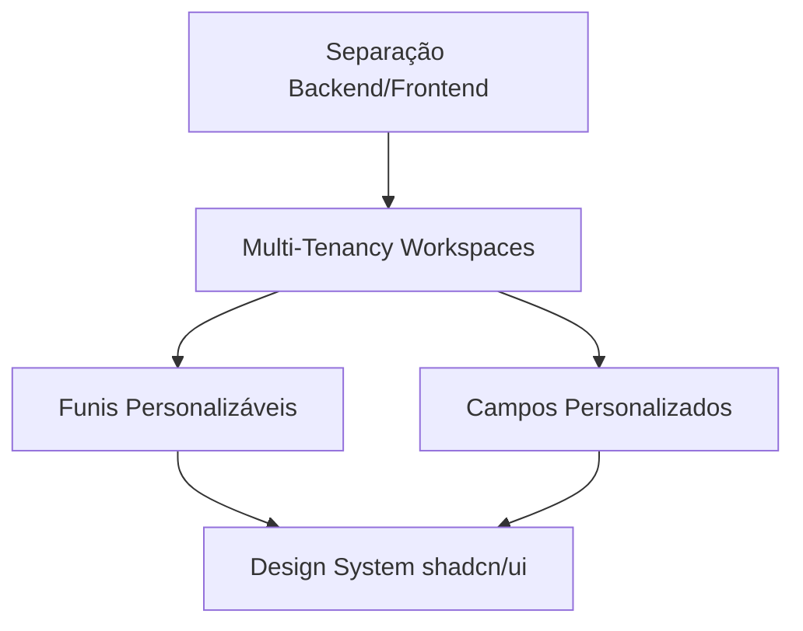

# 🚀 ROADMAP COMPLETO V2 - DNX Plataformas

> **Data**: 2025-11-21
> **Status**: 📋 Planejamento Estratégico
> **Prioridade**: CRÍTICA
> **Estimativa Total**: 60-80 horas (6-8 semanas)

---

## 🎯 VISÃO GERAL DAS MUDANÇAS

### 1. 🏢 Multi-Tenancy (Workspaces)
**Problema atual**: 1 usuário = 1 conta
**Solução**: Múltiplos usuários compartilhando workspace da empresa

### 2. 🎨 Design System Moderno
**Problema atual**: UI básica com Tailwind
**Solução**: shadcn/ui + tema oklch profissional

### 3. 🔄 Funis de Vendas Personalizáveis
**Problema atual**: "Tipos de negócio" fixos
**Solução**: Funis customizáveis criados pelo usuário

### 4. 🔧 Campos Personalizados
**Problema atual**: Campos fixos
**Solução**: Usuário cria campos personalizados por funil

### 5. 🏗️ Separação Backend/Frontend
**Problema atual**: Monolito Next.js
**Solução**: API independente + Frontend

---

## 📊 PRIORIZAÇÃO DAS MUDANÇAS



**Ordem de execução**:
1. Separação Backend/Frontend (base para tudo)
2. Multi-Tenancy (mudança estrutural no DB)
3. Funis + Campos Personalizados (features principais)
4. Design System (polish e UX)

---

## 🏗️ FASE 1: Separação Backend/Frontend (SEMANA 1-3)

> Ver detalhes em [SEPARACAO_BACKEND_FRONTEND.md](./SEPARACAO_BACKEND_FRONTEND.md)

### Entregáveis:
- ✅ Monorepo com Turborepo
- ✅ API Express independente
- ✅ Frontend Next.js consumindo API
- ✅ Types compartilhados
- ✅ Docker Compose atualizado

**Tempo**: 19-27 horas
**Status**: Documentado, pronto para executar

---

## 🏢 FASE 2: Multi-Tenancy - Workspaces (SEMANA 4-5)

### 2.1 Modelagem de Dados (4-6 horas)

#### Schema Atual (Simplificado)
```sql
users
├── id (PK)
├── email
├── password
├── name
├── role
└── plano_id (FK)

leads
├── id (PK)
├── user_id (FK) ← Problema: 1 lead = 1 usuário
├── nome
├── cpf
└── ...
```

#### Schema Novo (Multi-Tenancy)
```sql
-- Nova tabela: Workspaces (Empresas)
workspaces
├── id (PK)
├── name (ex: "DNX Plataformas", "Empresa XYZ")
├── slug (ex: "dnx-plataformas")
├── plano_id (FK) ← Plano é do workspace, não do usuário
├── created_at
└── settings (JSONB)

-- Nova tabela: Membros do Workspace
workspace_members
├── id (PK)
├── workspace_id (FK)
├── user_id (FK)
├── role (owner | admin | member | viewer)
├── permissions (JSONB)
├── joined_at
└── invited_by (FK users)

-- Tabela users atualizada
users
├── id (PK)
├── email
├── password
├── name
├── avatar_url
├── current_workspace_id (FK) ← Workspace ativo
└── created_at

-- Tabelas de recursos atualizadas
leads
├── id (PK)
├── workspace_id (FK) ← Agora pertence ao workspace
├── created_by (FK users)
├── funil_id (FK) ← Novo
├── nome
└── ...

whatsapp_instances
├── id (PK)
├── workspace_id (FK) ← Compartilhado no workspace
├── ...

datecode_consumptions
├── id (PK)
├── workspace_id (FK) ← Créditos por workspace
├── ...
```

### 2.2 Migrations (2-3 horas)

#### Migration 001: Criar Workspaces
```sql
-- apps/api/migrations/001_create_workspaces.sql
CREATE TABLE workspaces (
  id UUID PRIMARY KEY DEFAULT gen_random_uuid(),
  name TEXT NOT NULL,
  slug TEXT UNIQUE NOT NULL,
  plano_id INTEGER REFERENCES planos(id),
  settings JSONB DEFAULT '{}',
  created_at TIMESTAMP DEFAULT NOW(),
  updated_at TIMESTAMP DEFAULT NOW()
);

CREATE TABLE workspace_members (
  id UUID PRIMARY KEY DEFAULT gen_random_uuid(),
  workspace_id UUID REFERENCES workspaces(id) ON DELETE CASCADE,
  user_id INTEGER REFERENCES users(id) ON DELETE CASCADE,
  role TEXT CHECK (role IN ('owner', 'admin', 'member', 'viewer')),
  permissions JSONB DEFAULT '{}',
  joined_at TIMESTAMP DEFAULT NOW(),
  invited_by INTEGER REFERENCES users(id),
  UNIQUE(workspace_id, user_id)
);

-- Adicionar workspace_id em users
ALTER TABLE users
  ADD COLUMN current_workspace_id UUID REFERENCES workspaces(id);

-- Criar índices
CREATE INDEX idx_workspace_members_workspace ON workspace_members(workspace_id);
CREATE INDEX idx_workspace_members_user ON workspace_members(user_id);
```

#### Migration 002: Migrar dados existentes
```sql
-- Criar workspace para cada usuário existente
INSERT INTO workspaces (name, slug, plano_id)
SELECT
  name || '''s Workspace',
  LOWER(REPLACE(name, ' ', '-')) || '-' || id,
  plano_id
FROM users;

-- Adicionar usuários como owners dos seus workspaces
INSERT INTO workspace_members (workspace_id, user_id, role)
SELECT
  w.id as workspace_id,
  u.id as user_id,
  'owner' as role
FROM users u
JOIN workspaces w ON w.slug = LOWER(REPLACE(u.name, ' ', '-')) || '-' || u.id;

-- Atualizar current_workspace_id
UPDATE users u
SET current_workspace_id = (
  SELECT workspace_id
  FROM workspace_members
  WHERE user_id = u.id AND role = 'owner'
  LIMIT 1
);
```

#### Migration 003: Adicionar workspace_id nas tabelas
```sql
-- Leads
ALTER TABLE leads ADD COLUMN workspace_id UUID REFERENCES workspaces(id);
ALTER TABLE leads ADD COLUMN created_by INTEGER REFERENCES users(id);

UPDATE leads l
SET workspace_id = u.current_workspace_id,
    created_by = l.user_id
FROM users u
WHERE l.user_id = u.id;

ALTER TABLE leads ALTER COLUMN workspace_id SET NOT NULL;
CREATE INDEX idx_leads_workspace ON leads(workspace_id);

-- WhatsApp instances
ALTER TABLE whatsapp_instances ADD COLUMN workspace_id UUID REFERENCES workspaces(id);

UPDATE whatsapp_instances wi
SET workspace_id = u.current_workspace_id
FROM users u
WHERE wi.user_id = u.id;

ALTER TABLE whatsapp_instances ALTER COLUMN workspace_id SET NOT NULL;

-- Datecode consumptions
ALTER TABLE datecode_consumptions ADD COLUMN workspace_id UUID REFERENCES workspaces(id);

UPDATE datecode_consumptions dc
SET workspace_id = u.current_workspace_id
FROM users u
WHERE dc.user_id = u.id;

-- ... Repetir para todas as tabelas relevantes
```

### 2.3 Backend API (6-8 horas)

#### Criar endpoints de workspace
```typescript
// apps/api/src/routes/workspaces.ts
import express from 'express'
import { authMiddleware } from '../middleware/auth'
import * as workspaceController from '../controllers/workspace'

const router = express.Router()

// Listar workspaces do usuário
router.get('/', authMiddleware, workspaceController.listUserWorkspaces)

// Criar workspace
router.post('/', authMiddleware, workspaceController.createWorkspace)

// Detalhes do workspace
router.get('/:workspaceId', authMiddleware, workspaceController.getWorkspace)

// Atualizar workspace
router.patch('/:workspaceId', authMiddleware, workspaceController.updateWorkspace)

// Trocar workspace ativo
router.post('/:workspaceId/switch', authMiddleware, workspaceController.switchWorkspace)

// === Membros ===
// Listar membros
router.get('/:workspaceId/members', authMiddleware, workspaceController.listMembers)

// Convidar membro
router.post('/:workspaceId/members/invite', authMiddleware, workspaceController.inviteMember)

// Atualizar role de membro
router.patch('/:workspaceId/members/:memberId', authMiddleware, workspaceController.updateMemberRole)

// Remover membro
router.delete('/:workspaceId/members/:memberId', authMiddleware, workspaceController.removeMember)

export default router
```

#### Middleware de workspace
```typescript
// apps/api/src/middleware/workspace.ts
export async function workspaceMiddleware(req, res, next) {
  const user = req.user // Do authMiddleware
  const workspaceId = req.headers['x-workspace-id'] || user.current_workspace_id

  if (!workspaceId) {
    return res.status(400).json({ error: 'Workspace ID required' })
  }

  // Verificar se usuário tem acesso ao workspace
  const member = await db.workspace_members.findOne({
    where: { workspace_id: workspaceId, user_id: user.id }
  })

  if (!member) {
    return res.status(403).json({ error: 'Access denied to workspace' })
  }

  req.workspace = { id: workspaceId, role: member.role, permissions: member.permissions }
  next()
}

// Verificar permissões específicas
export function requireRole(...roles: string[]) {
  return (req, res, next) => {
    if (!roles.includes(req.workspace.role)) {
      return res.status(403).json({ error: 'Insufficient permissions' })
    }
    next()
  }
}
```

#### Atualizar rotas existentes
```typescript
// apps/api/src/routes/leads.ts
import { workspaceMiddleware, requireRole } from '../middleware/workspace'

// ANTES
router.get('/', authMiddleware, leadController.list)

// DEPOIS
router.get('/',
  authMiddleware,
  workspaceMiddleware,
  leadController.list
)

router.post('/',
  authMiddleware,
  workspaceMiddleware,
  requireRole('owner', 'admin', 'member'),
  leadController.create
)

// No controller
export async function list(req, res) {
  const { workspace } = req

  const leads = await db.leads.findAll({
    where: { workspace_id: workspace.id }
  })

  res.json(leads)
}
```

### 2.4 Frontend (4-6 horas)

#### Workspace Switcher
```typescript
// apps/web/components/layout/WorkspaceSwitcher.tsx
export function WorkspaceSwitcher() {
  const { workspaces, currentWorkspace, switchWorkspace } = useWorkspaces()

  return (
    <DropdownMenu>
      <DropdownMenuTrigger>
        <div className="flex items-center gap-2">
          <Avatar>
            <AvatarFallback>{currentWorkspace.name[0]}</AvatarFallback>
          </Avatar>
          <span>{currentWorkspace.name}</span>
          <ChevronDown />
        </div>
      </DropdownMenuTrigger>
      <DropdownMenuContent>
        {workspaces.map(workspace => (
          <DropdownMenuItem key={workspace.id} onClick={() => switchWorkspace(workspace.id)}>
            {workspace.name}
          </DropdownMenuItem>
        ))}
        <DropdownMenuSeparator />
        <DropdownMenuItem>
          <Plus className="mr-2" />
          Criar Workspace
        </DropdownMenuItem>
      </DropdownMenuContent>
    </DropdownMenu>
  )
}
```

#### Hook de workspaces
```typescript
// apps/web/hooks/useWorkspaces.ts
export function useWorkspaces() {
  const [workspaces, setWorkspaces] = useState([])
  const [currentWorkspace, setCurrentWorkspace] = useState(null)

  useEffect(() => {
    fetchWorkspaces()
  }, [])

  async function fetchWorkspaces() {
    const res = await api.get('/workspaces')
    setWorkspaces(res.data)
    setCurrentWorkspace(res.data.find(w => w.id === user.current_workspace_id))
  }

  async function switchWorkspace(workspaceId: string) {
    await api.post(`/workspaces/${workspaceId}/switch`)
    setCurrentWorkspace(workspaces.find(w => w.id === workspaceId))

    // Recarregar dados do workspace
    window.location.reload()
  }

  return { workspaces, currentWorkspace, switchWorkspace }
}
```

#### Gerenciamento de membros
```typescript
// apps/web/app/configuracoes-admin/membros/page.tsx
export default function MembrosPage() {
  const { members, inviteMember, updateRole, removeMember } = useWorkspaceMembers()

  return (
    <div>
      <h1>Membros do Workspace</h1>

      <Button onClick={() => setShowInviteDialog(true)}>
        Convidar Membro
      </Button>

      <Table>
        <TableHeader>
          <TableRow>
            <TableHead>Nome</TableHead>
            <TableHead>Email</TableHead>
            <TableHead>Role</TableHead>
            <TableHead>Ações</TableHead>
          </TableRow>
        </TableHeader>
        <TableBody>
          {members.map(member => (
            <TableRow key={member.id}>
              <TableCell>{member.user.name}</TableCell>
              <TableCell>{member.user.email}</TableCell>
              <TableCell>
                <Select value={member.role} onValueChange={(role) => updateRole(member.id, role)}>
                  <SelectItem value="owner">Owner</SelectItem>
                  <SelectItem value="admin">Admin</SelectItem>
                  <SelectItem value="member">Member</SelectItem>
                  <SelectItem value="viewer">Viewer</SelectItem>
                </Select>
              </TableCell>
              <TableCell>
                <Button variant="destructive" onClick={() => removeMember(member.id)}>
                  Remover
                </Button>
              </TableCell>
            </TableRow>
          ))}
        </TableBody>
      </Table>
    </div>
  )
}
```

**Tempo FASE 2**: 16-23 horas

---

## 🎯 FASE 3: Funis de Vendas Personalizáveis (SEMANA 5-6)

### 3.1 Modelagem de Dados (3-4 horas)

```sql
-- Funis de vendas (substituindo "tipos_negocio")
funis
├── id (PK)
├── workspace_id (FK) ← Cada workspace tem seus funis
├── nome (ex: "Venda de Imóveis", "Consultoria", "Leads Frios")
├── descricao
├── cor (hex)
├── icone
├── ordem (para ordenar na UI)
├── ativo (boolean)
├── created_by (FK users)
└── created_at

-- Estágios do funil
funil_estagios
├── id (PK)
├── funil_id (FK)
├── nome (ex: "Novo", "Contato", "Proposta", "Fechado", "Perdido")
├── cor (hex)
├── ordem
├── is_final (boolean) ← Ex: "Fechado" ou "Perdido"
├── tipo_final ('ganho' | 'perdido' | null)
└── created_at

-- Leads agora pertencem a um funil e estágio
ALTER TABLE leads
  ADD COLUMN funil_id UUID REFERENCES funis(id),
  ADD COLUMN estagio_id UUID REFERENCES funil_estagios(id);

-- Histórico de movimentação entre estágios
funil_historico
├── id (PK)
├── lead_id (FK)
├── funil_id (FK)
├── estagio_anterior_id (FK)
├── estagio_novo_id (FK)
├── moved_by (FK users)
├── motivo (TEXT)
└── moved_at
```

### 3.2 Backend API (5-7 horas)

```typescript
// apps/api/src/routes/funis.ts
router.get('/', authMiddleware, workspaceMiddleware, funilController.list)
router.post('/', authMiddleware, workspaceMiddleware, requireRole('owner', 'admin'), funilController.create)
router.patch('/:id', authMiddleware, workspaceMiddleware, requireRole('owner', 'admin'), funilController.update)
router.delete('/:id', authMiddleware, workspaceMiddleware, requireRole('owner', 'admin'), funilController.delete)

// Estágios
router.get('/:funilId/estagios', authMiddleware, workspaceMiddleware, funilController.listEstagios)
router.post('/:funilId/estagios', authMiddleware, workspaceMiddleware, requireRole('owner', 'admin'), funilController.createEstagio)
router.patch('/:funilId/estagios/:estagioId', authMiddleware, workspaceMiddleware, requireRole('owner', 'admin'), funilController.updateEstagio)
router.delete('/:funilId/estagios/:estagioId', authMiddleware, workspaceMiddleware, requireRole('owner', 'admin'), funilController.deleteEstagio)

// Mover lead entre estágios
router.post('/leads/:leadId/move', authMiddleware, workspaceMiddleware, funilController.moveLead)
```

### 3.3 Frontend (5-7 horas)

#### Gerenciamento de Funis
```typescript
// apps/web/app/configuracoes-admin/funis/page.tsx
export default function FunisPage() {
  const { funis, createFunil, updateFunil, deleteFunil } = useFunis()

  return (
    <div>
      <h1>Funis de Vendas</h1>

      <Button onClick={() => setShowCreateDialog(true)}>
        Criar Funil
      </Button>

      <div className="grid grid-cols-1 md:grid-cols-2 lg:grid-cols-3 gap-4">
        {funis.map(funil => (
          <Card key={funil.id}>
            <CardHeader>
              <div className="flex items-center gap-2">
                <div className="w-4 h-4 rounded" style={{backgroundColor: funil.cor}} />
                <CardTitle>{funil.nome}</CardTitle>
              </div>
            </CardHeader>
            <CardContent>
              <p>{funil.descricao}</p>
              <div className="mt-4">
                <p className="text-sm text-muted-foreground">
                  {funil.estagios.length} estágios
                </p>
              </div>
            </CardContent>
            <CardFooter>
              <Button variant="outline" onClick={() => editFunil(funil)}>
                Editar
              </Button>
              <Button variant="ghost" onClick={() => viewEstagios(funil)}>
                Estágios
              </Button>
            </CardFooter>
          </Card>
        ))}
      </div>
    </div>
  )
}
```

#### Kanban Board por Funil
```typescript
// apps/web/app/leads/page.tsx
export default function LeadsKanbanPage() {
  const { funil } = useFunil()
  const { estagios } = useEstagios(funil.id)
  const { leads, moveLead } = useLeads(funil.id)

  return (
    <div>
      <FunilSelector />

      <div className="flex gap-4 overflow-x-auto">
        {estagios.map(estagio => (
          <div key={estagio.id} className="min-w-[300px]">
            <div className="bg-muted p-2 rounded-t">
              <h3>{estagio.nome}</h3>
              <span className="text-sm text-muted-foreground">
                {leads.filter(l => l.estagio_id === estagio.id).length} leads
              </span>
            </div>

            <div className="space-y-2 p-2 bg-background">
              {leads
                .filter(l => l.estagio_id === estagio.id)
                .map(lead => (
                  <LeadCard
                    key={lead.id}
                    lead={lead}
                    onMove={(novoEstagio) => moveLead(lead.id, novoEstagio.id)}
                  />
                ))}
            </div>
          </div>
        ))}
      </div>
    </div>
  )
}
```

**Tempo FASE 3**: 13-18 horas

---

## 🔧 FASE 4: Campos Personalizados (SEMANA 6-7)

### 4.1 Modelagem de Dados (3-4 horas)

```sql
-- Campos personalizados por funil
funil_campos_personalizados
├── id (PK)
├── funil_id (FK)
├── nome (ex: "Orçamento", "Data da Visita", "Origem")
├── tipo ('text' | 'number' | 'date' | 'select' | 'multi-select' | 'boolean' | 'url' | 'email' | 'phone')
├── opcoes (JSONB) ← Para select/multi-select: ["Opção 1", "Opção 2"]
├── obrigatorio (boolean)
├── ordem
├── ativo (boolean)
└── created_at

-- Valores dos campos personalizados
lead_campos_valores
├── id (PK)
├── lead_id (FK)
├── campo_id (FK funil_campos_personalizados)
├── valor (TEXT) ← Armazena como string, converte no frontend
└── updated_at
```

### 4.2 Backend API (4-6 horas)

```typescript
// apps/api/src/routes/campos-personalizados.ts
router.get('/funis/:funilId/campos', authMiddleware, workspaceMiddleware, campoController.listCampos)
router.post('/funis/:funilId/campos', authMiddleware, workspaceMiddleware, requireRole('owner', 'admin'), campoController.createCampo)
router.patch('/campos/:campoId', authMiddleware, workspaceMiddleware, requireRole('owner', 'admin'), campoController.updateCampo)
router.delete('/campos/:campoId', authMiddleware, workspaceMiddleware, requireRole('owner', 'admin'), campoController.deleteCampo)

// Valores de campos para um lead
router.get('/leads/:leadId/campos', authMiddleware, workspaceMiddleware, campoController.getLeadCampos)
router.put('/leads/:leadId/campos', authMiddleware, workspaceMiddleware, campoController.updateLeadCampos)
```

### 4.3 Frontend (5-7 horas)

#### Gerenciamento de Campos
```typescript
// apps/web/app/configuracoes-admin/funis/[funilId]/campos/page.tsx
export default function CamposPersonalizadosPage() {
  const { funil } = useFunil()
  const { campos, createCampo, updateCampo, deleteCampo } = useCamposPersonalizados(funil.id)

  return (
    <div>
      <h1>Campos Personalizados - {funil.nome}</h1>

      <Button onClick={() => setShowCreateDialog(true)}>
        Adicionar Campo
      </Button>

      <Table>
        <TableHeader>
          <TableRow>
            <TableHead>Nome</TableHead>
            <TableHead>Tipo</TableHead>
            <TableHead>Obrigatório</TableHead>
            <TableHead>Ações</TableHead>
          </TableRow>
        </TableHeader>
        <TableBody>
          {campos.map(campo => (
            <TableRow key={campo.id}>
              <TableCell>{campo.nome}</TableCell>
              <TableCell>{getTipoLabel(campo.tipo)}</TableCell>
              <TableCell>{campo.obrigatorio ? 'Sim' : 'Não'}</TableCell>
              <TableCell>
                <Button variant="ghost" onClick={() => editCampo(campo)}>Editar</Button>
                <Button variant="ghost" onClick={() => deleteCampo(campo.id)}>Remover</Button>
              </TableCell>
            </TableRow>
          ))}
        </TableBody>
      </Table>
    </div>
  )
}
```

#### Renderizar Campos Dinâmicos
```typescript
// apps/web/components/forms/DynamicFields.tsx
export function DynamicFields({ campos, valores, onChange }) {
  return (
    <div className="space-y-4">
      {campos.map(campo => (
        <div key={campo.id}>
          <Label>{campo.nome} {campo.obrigatorio && '*'}</Label>
          {renderField(campo, valores[campo.id], (value) => onChange(campo.id, value))}
        </div>
      ))}
    </div>
  )
}

function renderField(campo, valor, onChange) {
  switch (campo.tipo) {
    case 'text':
      return <Input value={valor} onChange={(e) => onChange(e.target.value)} />

    case 'number':
      return <Input type="number" value={valor} onChange={(e) => onChange(e.target.value)} />

    case 'date':
      return <Input type="date" value={valor} onChange={(e) => onChange(e.target.value)} />

    case 'select':
      return (
        <Select value={valor} onValueChange={onChange}>
          {campo.opcoes.map(opcao => (
            <SelectItem key={opcao} value={opcao}>{opcao}</SelectItem>
          ))}
        </Select>
      )

    case 'boolean':
      return <Checkbox checked={valor === 'true'} onCheckedChange={(checked) => onChange(String(checked))} />

    // ... outros tipos
  }
}
```

**Tempo FASE 4**: 12-17 horas

---

## 🎨 FASE 5: Design System shadcn/ui + Tema OKLCH (SEMANA 7-8)

### 5.1 Setup shadcn/ui (2-3 horas)

```bash
# apps/web/
npx shadcn@latest init

# Instalar componentes necessários
npx shadcn@latest add button
npx shadcn@latest add card
npx shadcn@latest add dropdown-menu
npx shadcn@latest add table
npx shadcn@latest add dialog
npx shadcn@latest add select
npx shadcn@latest add checkbox
npx shadcn@latest add avatar
npx shadcn@latest add sidebar
# ... outros componentes conforme necessário
```

### 5.2 Aplicar Tema OKLCH (1-2 horas)

```css
/* apps/web/app/globals.css */
@tailwind base;
@tailwind components;
@tailwind utilities;

@layer base {
  :root {
    --radius: 0.65rem;
    --background: oklch(1 0 0);
    --foreground: oklch(0.141 0.005 285.823);
    --card: oklch(1 0 0);
    --card-foreground: oklch(0.141 0.005 285.823);
    --popover: oklch(1 0 0);
    --popover-foreground: oklch(0.141 0.005 285.823);
    --primary: oklch(0.648 0.2 131.684);
    --primary-foreground: oklch(0.986 0.031 120.757);
    --secondary: oklch(0.967 0.001 286.375);
    --secondary-foreground: oklch(0.21 0.006 285.885);
    --muted: oklch(0.967 0.001 286.375);
    --muted-foreground: oklch(0.552 0.016 285.938);
    --accent: oklch(0.967 0.001 286.375);
    --accent-foreground: oklch(0.21 0.006 285.885);
    --destructive: oklch(0.577 0.245 27.325);
    --border: oklch(0.92 0.004 286.32);
    --input: oklch(0.92 0.004 286.32);
    --ring: oklch(0.841 0.238 128.85);
    --chart-1: oklch(0.871 0.15 154.449);
    --chart-2: oklch(0.723 0.219 149.579);
    --chart-3: oklch(0.627 0.194 149.214);
    --chart-4: oklch(0.527 0.154 150.069);
    --chart-5: oklch(0.448 0.119 151.328);
    --sidebar: oklch(0.985 0 0);
    --sidebar-foreground: oklch(0.141 0.005 285.823);
    --sidebar-primary: oklch(0.648 0.2 131.684);
    --sidebar-primary-foreground: oklch(0.986 0.031 120.757);
    --sidebar-accent: oklch(0.967 0.001 286.375);
    --sidebar-accent-foreground: oklch(0.21 0.006 285.885);
    --sidebar-border: oklch(0.92 0.004 286.32);
    --sidebar-ring: oklch(0.841 0.238 128.85);
  }

  .dark {
    --background: oklch(0.141 0.005 285.823);
    --foreground: oklch(0.985 0 0);
    --card: oklch(0.21 0.006 285.885);
    --card-foreground: oklch(0.985 0 0);
    --popover: oklch(0.21 0.006 285.885);
    --popover-foreground: oklch(0.985 0 0);
    --primary: oklch(0.648 0.2 131.684);
    --primary-foreground: oklch(0.986 0.031 120.757);
    --secondary: oklch(0.274 0.006 286.033);
    --secondary-foreground: oklch(0.985 0 0);
    --muted: oklch(0.274 0.006 286.033);
    --muted-foreground: oklch(0.705 0.015 286.067);
    --accent: oklch(0.274 0.006 286.033);
    --accent-foreground: oklch(0.985 0 0);
    --destructive: oklch(0.704 0.191 22.216);
    --border: oklch(1 0 0 / 10%);
    --input: oklch(1 0 0 / 15%);
    --ring: oklch(0.405 0.101 131.063);
    --chart-1: oklch(0.871 0.15 154.449);
    --chart-2: oklch(0.723 0.219 149.579);
    --chart-3: oklch(0.627 0.194 149.214);
    --chart-4: oklch(0.527 0.154 150.069);
    --chart-5: oklch(0.448 0.119 151.328);
    --sidebar: oklch(0.21 0.006 285.885);
    --sidebar-foreground: oklch(0.985 0 0);
    --sidebar-primary: oklch(0.768 0.233 130.85);
    --sidebar-primary-foreground: oklch(0.986 0.031 120.757);
    --sidebar-accent: oklch(0.274 0.006 286.033);
    --sidebar-accent-foreground: oklch(0.985 0 0);
    --sidebar-border: oklch(1 0 0 / 10%);
    --sidebar-ring: oklch(0.405 0.101 131.063);
  }
}

@layer base {
  * {
    @apply border-border;
  }
  body {
    @apply bg-background text-foreground;
  }
}
```

### 5.3 Refatorar Componentes (10-15 horas)

#### Migrar componentes existentes para shadcn/ui
- [ ] Buttons → shadcn Button
- [ ] Forms → shadcn Form + Input + Label
- [ ] Tables → shadcn Table
- [ ] Dialogs/Modals → shadcn Dialog
- [ ] Dropdowns → shadcn DropdownMenu
- [ ] Sidebar → shadcn Sidebar
- [ ] Cards → shadcn Card

#### Usar blocos do shadcn/ui
- [ ] Dashboard blocks: https://ui.shadcn.com/blocks#dashboard-01
- [ ] Sidebar blocks: https://ui.shadcn.com/blocks#sidebar-01
- [ ] Authentication blocks: https://ui.shadcn.com/blocks#authentication-01
- [ ] Charts: https://ui.shadcn.com/docs/components/chart

**Tempo FASE 5**: 13-20 horas

---

## 📅 CRONOGRAMA CONSOLIDADO

| Fase | Descrição | Duração | Semanas |
|------|-----------|---------|---------|
| **FASE 1** | Separação Backend/Frontend | 19-27h | Sem 1-3 |
| **FASE 2** | Multi-Tenancy Workspaces | 16-23h | Sem 4-5 |
| **FASE 3** | Funis Personalizáveis | 13-18h | Sem 5-6 |
| **FASE 4** | Campos Personalizados | 12-17h | Sem 6-7 |
| **FASE 5** | Design shadcn/ui + OKLCH | 13-20h | Sem 7-8 |
| **TOTAL** | | **73-105h** | **8 semanas** |

---

## 🎯 MÉTRICAS DE SUCESSO

### Multi-Tenancy
- [ ] Múltiplos usuários em um workspace
- [ ] Roles funcionando (owner/admin/member/viewer)
- [ ] Workspace switcher na UI
- [ ] Dados isolados por workspace

### Funis + Campos
- [ ] Usuário cria funil personalizado
- [ ] Usuário cria estágios personalizados
- [ ] Kanban board por funil
- [ ] Campos personalizados por funil
- [ ] Leads com campos dinâmicos

### Design
- [ ] Tema OKLCH aplicado
- [ ] shadcn/ui em todos componentes
- [ ] Dark mode funcionando
- [ ] UI profissional e consistente
- [ ] Responsivo (mobile/desktop)

---

## 🚀 BENEFÍCIOS FINAIS

### Para o Negócio
✅ **Multi-empresa**: Vender para empresas com múltiplos usuários
✅ **Personalização**: Cada cliente configura seu CRM
✅ **Escalabilidade**: Arquitetura preparada para crescimento
✅ **Profissionalismo**: UI moderna e polida

### Para os Usuários
✅ **Colaboração**: Múltiplos usuários trabalhando juntos
✅ **Flexibilidade**: Funis e campos personalizados
✅ **UX moderna**: shadcn/ui com tema profissional
✅ **Produtividade**: Kanban visual, campos customizados

---

**Criado**: 2025-11-21
**Última atualização**: 2025-11-21
**Versão**: 2.0
**Status**: Pronto para execução
